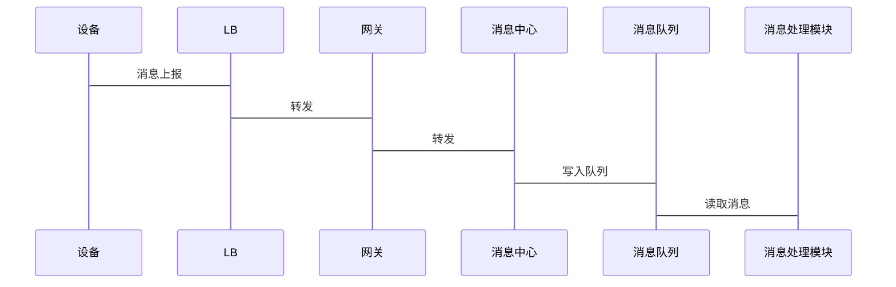

#   项目和各种问题

1.  数据同步
  - 设计问题：
    - 旧的设计是push模式，没法控制设备处理数据的速度，可能出现数据异常时，设备无法及时处理，导致数据不同步
    - 设备可能不在线，此时需要维护下发内容，定时重试，重试时系统有可能有新的修改，同步数据维护复杂度较高
    - 每个设备需要单独维护
  - 后台下发数据后，设备还可能在GUI修改数据，导致数据不一致。 解决方法：增加设备绑定机制，设备接入系统后绑定，不允许在单机修改。

  - 新的设计采用client-server模型，设备作为客户端，向后台服务发起请求，由设备本身去处理数据，设备自身对一些数据处理进行优化
  - 旧版本，通过长连接发送数据给设备
  - 新版本，设备作为客户端，向后台发起请求，进行数据同步
  - 通过版本号的方式，来实现设备-系统数据同步，大版本：人员库版本，一个设备一个版本，具体到某个人的具体信息，每个人有一个版本号

2. 考勤统计
   - 将时间段抽象为时间节点，根据不同计划类型，构造时间节点列表，依次判断打卡时间落在哪个节点上
   - 方便扩展
   
3. 消息上报正常流程：



4. 消息上报异常

   - 设备上报失败，重试
   - LB，网关集群
   - 消息队列写失败解决：事务，投递后ack
   - 读取解析失败：重试（容易导致一直循环），重试几次后保存，在后续处理

5. 考勤异常

   - 定时任务处理
   - 时间节点链
   - 异常的更新
   - 统计的更新

6. 人脸识别

   - 在后台进行人脸识别，将特征值同步到设备。在存在不同算法版本时，容易降低识别成功率。

     例如，后台使用v1版本算法，但设备升级到v2版本，特征值有所区别，容易降低识别率

   - 解决：后台只进行人脸检测，并做初步过滤，筛选出满足设备识别所需的照片，

     并对通过人脸检测，计算出人脸关键点等数据，同步到设备，设备再根据照片和关键点进行识别，

     识别后的特征保存在设备，这样方便各个设备支持不同算法版本

7. 大量考勤记录，如何保存在数据库

   - MySQL分区表：暂时能够满足需求
     - 分区的字段，必须是表上所有的唯一索引（或者主键索引）包含的字段的子集
     - id，punchDate作为主键，按punchDate分区，分区方式是水平分区，range分区
     - 业务场景中大量查询都是集中在最近一个月，分区优化查询，减少历史的考勤记录的影响
     - 分区表和单库分表的并发能力有限，**受到单个实例和服务器的限制**
     - 分区表能够满足我们需求的情况下，它的开发成本和维护成本要比分库分表小很多
   - 优化：分库分表

8. 消息中心使用netty实现 

9. 如何解决设备消息的重复消费

10. 设备token校验

    redis缓存

11. 定时任务如何避免多机同时执行

    分布式锁

12. 大量记录查询时，索引如何设计？

13. 服务启动时JVM参数如何配置

14. 照片如何存储

    - 加密，对称加密算法，
    - 文件挂载：nfs是网络文件系统，允许一个节点通过网络访问远程计算机的文件系统，远程文件系统可以被直接挂载到本地，文件操作和本地没有区别
    
15. 最深入的项目是？难点，坑点

    1. 难点
       1. 后台-设备数据同步
       2. 考勤计算规则的抽象

16. Linux掌握情况，常用命令

17. 常用数据结构

    1. 数组，arrayList，set，map

18. 项目的监控和警报 todo

19. 实时配置推送怎么做

    1. 在配置中心apollo修改配置并发布
    2. 配置中心通知应用服务有配置更新，与spring结合，监听apollo配置变更
    3. 应用服务从配置中心获取最新配置
    
20. 头条的文章的评论量非常大, 比如说一篇热门文章就有几百万的评论, 设计一个后端服务, 实现评论的时序展示与分页

    1. 不支持页码直接跳转
       1. 传评论 id 用 offset 翻页
       2. 用 id 翻页的方式, 数据库表如何设计? 索引如何设计?
          1. (文章id, 评论id) 建联合索引，评论 id 需递增
       3. 假如量很大, 你觉得需要分库分表吗? 怎么分?
          1. 需要分，分表有个权衡，按文章 id 分表，读逻辑简单，但写有热点问题；按评论 id 分表，读逻辑复杂，但写压力就平均了。写是要首先保证的，而读总是有缓存等方案来折中，因此按评论 id 分表好
       4. 分库分表后怎么查询分页
          1. 每张表查 N 条数据由 client 或 proxy merge
       5. 分库分表后怎么保证主键仍然是递增的
          1. 淘宝的TDDL(Taobao Distribute Data Layer)技术
          2. 有一张专门用于分配主键的表，每次用乐观锁的方式尝试去取一批主键过来分配，假如乐观锁失败就重试
          3. 递增，用分布式UUID只能解决唯一性，不能解决递增
       
    2. 支持跳转（深分页）
    
       1. 不能做精准深分页，否则压力太大，考虑在50或100页后数据分页是否可以不完全精确。
    
       2. 深分页，mysql 层面，* from table limit M, N，当offset值过大，sql查询语句会非常缓慢
    
       3. 不支持深分页时，用where再limit，可以极大提高查询效率
    
          ```
          where id>10073 order by id asc limit 20
          ```
    
       4. 缓存深页码的起始评论 id
    
       5. 瞬时写入量很大可能会打挂存储, 怎么保护
    
          1. 请求限流，断路器，hystrix
          2. 写入消息队列，削峰
    
       


# 项目问题

1. 日常工作的时间比例
   1. 开发阶段
      1. 设计，评审
      2. 开发，60-70%
      3. 产品细节确认， 10-20%
2. 团队规模
   1. 系统前端 2
   2. 系统后端 4
   3. 设备 2-3
   4. 算法1-2
3. 角色
   1. 后端开发
   2. 协调项目整体进度
   3. 对接算法
   4. 对接设备
4. 技术架构
   1. 后台服务基于springcloud架构
   2. 网关spring cloud gateway
   3. 后端与设备交互，netty， 设备接入服务，设备消息上报服务
   4. 前端vue.js + 小程序
5. 技术栈
   1. spring cloud
   2. mysql
   3. redis
   4. netty
   5. rabbitMQ
   6. 
6. 微服务怎么拆分
   1. 高内聚、低耦合，单一职责的业务划分为一个服务， 考勤业务
   2. 按业务范围拆分，考勤业务，设备管理业务，设备接入，设备消息上报，鉴权服务
   3. 按功能拆分，业务范围较大时，可按功能再拆
   4. 拆分不是一步到位，一开始不确定范围，可粗粒度拆分，随着业务变化，再细分
   5. 避免循环依赖
7. 挑战和亮点
   1. 挑战/难题
      1. 设备-系统数据同步，
         1. 踩了坑，由服务器长链接推送数据给设备，设备性能问题
         2. 服务端逻辑复杂度提高了
      2. 考勤异常计算和相关统计，尽量可配置化，提高可维护性，以为考勤的业务，不同用户都可能有比较独特的需求
         1. 抽象时间节点，方便对不同类型计划、排班、请假。外出等各种情况进行计算
         2. 设备协议对接，功能交互，两端协调配合问题。 沟通、流程、协议评审
      3. 项目进度：要对接多方的时候，控制项目进度，及时沟通，制定时间计划节点，及时同步给各方，明确各方任务，要做的事情。 每方都有一个接口人。
   2. 亮点
      1. 设备-系统数据同步方案更新，
         1. 采用req-response，由设备发起请求，服务端维护数据，通过版本号，细粒度地判断数据变更
         2. 设备处理同步数据过程，失败重试
      2. 人脸识别算法，系统端作初步识别
      3. 设备的图片推送，netty，自定义协议
   
   

# Java

1. 出现OOM怎么排查

   - 内存溢出：申请的内存超过了JVM可分配内存，检查JVM参数配置
   - 内存泄漏：申请使用完的内存没有及时释放。通过heap dump分析，Heap dump文件是一个二进制文件，它保存了某一时刻JVM堆中对象使用情况。Heap dump文件是指定时刻的Java堆栈的快照，是一种镜像文件。Heap dump一般都包含了一个堆中的Java Objects, Class等基本信息。
   - 生成方式：通过jmap命令生成；使用jconsonle生成；
   - 分析工具：Eclipse Memory Analyzer

2. hashMap扩容，每个entry要重新计算一次hash值吗？

   - 不需要
   - 特殊的索引计算，只有两种情况
     - 在原来的位置
     - 原来的位置 + 原来的size

3. Map, linkedHashMap, treeMap

   1. HashMap
      1. 数组 + 链表 + 红黑树
      2. get/put 时间， O（1）， 通过hashCode
   2. LinkedHashMap
      1. 数组 + 双向链表
      2. 删除和表头插入等操作都是O（1）复杂度
      3. 插入，查询，删除LRU元素等操作均是O（1）的时间复杂度
      4. LinkedHashMap有序，可分为插入顺序和访问顺序两种。如果是访问顺序，那put和get操作已存在的Entry时，都会把Entry移动到双向链表的表尾(其实是先删除再插入)
      5. LinkedHashMap删除最老元素时，删除的是双向链表表头（算法实现）
      6. LinkedHashMap存取数据，还是跟HashMap一样使用的Entry[]的方式，双向链表只是为了保证顺序
   3. treeMap
      1. 数组 + 红黑树
      2. put/get 时间复杂度 O(log(n))

4. treeMap实现一致性hash

   1. 在保证合理分散的情况下，我们还是**可拓展**的。这就是一致性hash，一致性hash 算法都是将 value 映射到一个 32 位的 key 值，也即是 0~2^32-1 次方的数值空间；我们可以将这个空间想象成一个首（ 0 ）尾（ 2^32-1 ）相接的**圆环**，当有数据过来按顺时针找到离他最近的一个点，这个点，就是我要的节点机器
   2. 一致性hash环，映射的数组空间，类似于环
   3. 平衡性
      1. 哈希的结果能够尽可能分布到所有的缓存中去
      2. 使用虚拟节点
   4. treeMap key可排序，红黑树排序
   5. tailMap，获取key大于某值的map
      1. 把hash值作为key，物理节点作为value存放到Map中
      2. 在计算数据key需要存放到哪个物理节点时，先计算出key的hash值，然后调用TreeMap.tailMap()返回比hash值大的map子集
      3. 如果子集为空就需要把TreeMap的第一个元素返回，如果不为空，那么取子集中的第一个元素

5. hashMap什么时候扩容？

   - loadFactory 负载因子

6. synchronized 锁

   - 偏向锁，对象头设置锁信息
   - 轻量级锁
   - 重量级锁

7. LinkHashMap实现LRU算法

   创建LRULinkedHashMap继承LinkedHashMap并重写removeEldestEntry方法，该方法返回的boolean代表是否删除最早使用/存放的Entry。

   双向列表，迭代顺序可以使插入顺序或者访问顺序

8. JDK1.8之前HashMap为什么有死循环问题？

   1. 在并发下的扩容，重新生成链表，形成循环链表

9. HashMap为什么要用红黑树

      1. hash冲突时，使用链表存放相同hash的node，链表过长时，影响性能

      2. 普通二叉树，可能退化成链表，影响性能

      3. 红黑树可以自平衡，调整树的结构

10. ConcurrentHashMap如何保证并发并提高性能 

         1. JDK8中新增了红黑树

         2. JDK7中使用的是头插法，JDK8中使用的是尾插法

         3. JDK8中没有使用ReentrantLock了，而使用了Synchronize

         4. 和HashMap的扩容类似，只不过支持了多线程扩容，并且保证了线程安全

         5. JDK7
            1. JDK7中ConcurrentHashMap是通过ReentrantLock+CAS+分段思想来保证的并发安全的

         6. JDK8：
            1. JDK8中使用synchronized加锁时，是对链表头结点和红黑树根结点来加锁
            2. 数组中某个位置的元素一定是链表的头结点或红黑树的根结点
            3. jdk也已经对synchronized的底层工作机制进行了优化

11. 红黑树：

       1. 自平衡的二叉查找树
       2.  O(logN) 时间内完成查找、增加、删除等操作
       3. 根是黑色，节点是红色或黑色
       4. 从每个叶子到根的所有路径上不能有两个连续的红色节点 

12. CMS GC 

13. HashMap长度为什么是2的幂

14. 乐观锁和悲观锁

       1. 乐观锁：乐观锁在操作数据时非常乐观，认为别人不会同时修改数据
       2. 悲观锁：悲观锁在操作数据时比较悲观，认为别人会同时修改数据

15. 乐观锁悲观锁实现机制

       1. 乐观锁实现：CAS机制和版本号机制
          1. CAS （Compare And Swap）
             1. 将内存位置的值与预期进行比较，如果一样，则更新为新的值
             2. CAS包含了Compare和Swap两个操作，由CPU支持的原子操作，其原子性是在硬件层面进行保证（JVM）
             3. CAS 会产生ABA问题，引入版本号解决
          2. 乐观锁加锁吗？
             1. 观锁本身是不加锁的，只是在更新时判断一下数据是否被其他线程更新了
          3. 乐观锁CPU开销较大，如果失败，一致重试
       2. 悲观锁实现
          1. 在操作之前先上锁
          2. Java 里面的同步 synchronized 关键字的实现

16. 如何排查死锁

       thread dump 线程信息，线程状态，堆栈

17. ArrayList扩容

       1. add，添加元素
       2. ensureCapacityInternal：判断是否需要扩容
       3. grow：int newCapacity = oldCapacity + (oldCapacity >> 1),所以 ArrayList 每次扩容之后容量都会变为原来的 1.5 倍左右
       4. arrays.copyOf调用System.arraycopy，复制数组

18. Vector

       1. List实现类，object[] 实现
       2. 同步的，方法加了synchronized

19. set对比

       1. HashSet、LinkedHashSet 和 TreeSet 都是 Set 接口的实现类，都能保证元素唯一，并且都不是线程安全的
       2. 数据结构
          1. HashSet：哈希表（基于 `HashMap` 实现）
          2. LinkedHashSet ：链表和哈希表，元素的插入和取出顺序满足 FIFO
          3. TreeSet ：红黑树，元素是有序的，排序的方式有自然排序和定制排序

20. PriorityQueue

       1. 利用了二叉堆的数据结构来实现的，底层使用可变长的数组来存储数据
       2. 通过堆元素的上浮和下沉，实现了在 O(logn) 的时间复杂度内插入元素和删除堆顶元素
       3. 非线程安全的
       4. 默认是小顶堆，但可以接收一个 Comparator 作为构造参数，从而来自定义元素优先级的先后
       5. 常用场景：堆排序、求第K大的数、带权图的遍历

21. HashMap 和 Hashtable 的区别

       1. HashMap 是非线程安全的，Hashtable 是线程安全的,因为 Hashtable 内部的方法基本都经过synchronized 修饰
       2. Hashtable 基本被淘汰，不要在代码中使用
       3. 底层实现：JDK1.8 以后的 `HashMap` 在解决哈希冲突时有了较大的变化，当链表长度大于阈值（默认为 8）（将**链表转换成红黑树**前会判断，如果当前数组的长度小于 64，那么会选择先进行数组扩容，而不是转换为红黑树）时，将链表转化为红黑树，以减少搜索时间。Hashtable 没有这样的机制。

22. HashMap 和 HashSet 区别

       1. HashSet 底层就是基于 HashMap 实现的
       2. HashSet：set接口，存储对象，使用成员对象来计算 hashcode 值
       3. HashMap，map接口，存储k-v，put放入元素，使用key计算hashcode
          1. 底层是 数组和链表
          2. hash是否相同，相同用拉链法
          3. JDK1.8 之后，链表长度大于阈值（默认为 8）（将链表转换成红黑树前会判断

23. 红黑树

24. HashMap 和 TreeMap ，LinkedListMap

          1. TreeMap：
             1. 按key排序
             2. 集合内元素搜索，tailMap实现一致性hash算法
          2. LinkedListMap
             1. 记录了元素的访问顺序
             2. 可用于实现LRU

25. HashMap在扩容时读写操作如何进行

       1. 对于get读操作，如果当前节点有数据，还没迁移完成，此时不影响读，能够正常进行
       2. 对于put/remove写操作，如果扩容没有完成，当前链表的头节点会被锁住，所以写线程会被阻塞，直到扩容完成

26. HashSet判断重复

       1. 计算hashCode
          1. hashCode不同，不同元素
          2. hashCode相同，调用equals方法
          3. hashCode和equals相关内容， 两个方法要同时重写

27. HashMap 的长度为什么是 2 的幂次方

       1. 为了能让 HashMap 存取高效，尽量较少碰撞，特地设计的数组下标的计算方法
       2. JDK1.8之后，HashMap扩容，不再需要重新计算hash，**将hash值与扩容前的长度进行与操作**，根据结果为0还是不为0扩容后有两种情况
          1. 为0：位置不变
          2. 不为0：新的位置=老的位置+老的数组长度

28. 异常类型

          1. throwable
             1. exception
                1. check exception
                   1. IOException，没有处理编译无法通过
                2. uncheck exception
                   1. NullPointException
             2. error：程序无法处理的错误
                1. stackoverflow

29. 集合继承关系

          1. list，set继承与collection，map不是

30. IO流

             1. 按流向划分
                1. 输入流
                2. 输出流
             2. 按字节/字符划分：字符流是由 Java 虚拟机将字节转换得到的，问题就出在这个过程还算是非常耗时，并且，如果我们不知道编码类型就很容易出现**乱码问题**。所以， I/O 流就干脆提供了一个直接操作字符的接口，方便我们平时对字符进行流操作。如果音频文件、图片等媒体文件用字节流比较好，如果涉及到字符的话使用字符流比较好
                1. 字节流
                2. 字符流

31. 基本数据类型和字节数

             | 数据类型 | 字节数 | 默认值         |      |
             | -------- | ------ | -------------- | ---- |
             | byte     | 1      | (byte)0        |      |
             | short    | 2      | (short)0       |      |
             | int      | 4      | 0              |      |
             | long     | 8      | 0L             |      |
             | float    | 4      | 0.0f           |      |
             | double   | 8      | 0.0d           |      |
             | char     | 2      | '/uoooo'(null) |      |
             | boolean  | 1      | false          |      |

32. 泛型

                1. 泛型的本质是为了**参数化类型**（在不创建新的类型的情况下，通过泛型指定的不同类型来控制形参具体限制的类型）。也就是说在泛型使用过程中，
              
                   操作的数据类型被指定为一个参数，这种参数类型可以用在类、接口和方法中，分别被称为泛型类、泛型接口、泛型方法
              
                2.  ```
                   List<String> arrayList = new ArrayList<String>();
                   ...
                   //arrayList.add(100); 在编译阶段，编译器就会报错
                   ```
              
                3. 使用
              
                   1. 泛型类，如list，set， 指定了参数类型后，就只能传入这个类型，List<String>
              
                   2. 泛型接口，与泛型类类似
              
                   3. 泛型通配符：类型通配符一般是使用？代替具体的类型实参
              
                   4. 泛型方法：在调用方法的时候指明泛型的具体类型
              
                      1. ```
                             /** 
                              * 这才是一个真正的泛型方法。
                              * 首先在public与返回值之间的<T>必不可少，这表明这是一个泛型方法，并且声明了一个泛型T
                              * 这个T可以出现在这个泛型方法的任意位置.
                              * 泛型的数量也可以为任意多个 
                              *    如：public <T,K> K showKeyName(Generic<T> container){
                              *        ...
                              *        }
                              */
                             public <T> T showKeyName(Generic<T> container){
                                 System.out.println("container key :" + container.getKey());
                                 //当然这个例子举的不太合适，只是为了说明泛型方法的特性。
                                 T test = container.getKey();
                                 return test;
                             }
                         ```
                   
                4. 类型擦除
              
                   1. 类型擦除指的是在Java泛型程序运行过程中出现的**类型被转换为Object或者其限定类型**的现象
                   2. 所有的泛型类型在运行过程中都会被擦除
              
                5. 常用通配符
              
                   1. ？无界通配符
                   2. 上界通配符 < ? extends E>
                   3. 下界通配符 < ? super E>

33. String 类能不能被继承？为什么

                1. 不能, string类是final声明
                2. 为了实现字符串常量池, **只有当字符串是不可变的，字符串池才有可能实现**, 字符串池的实现可以在运行时节约很多heap空间，因为不同的字符串变量都指向池中的同一个字符串
                3. 因为字符串是不可变的，所以**是多线程安全的**
                4. 字符串是不可变的，所以在它创建的时候**HashCode**就被缓存了，不需要重新计算

34. == 和equals
                1. ==
                   1. 比较基本类型, 比较值
                   2. 比较对象类型, 比较内存地址
                2. equals
                   1. 没有重写equals, 调用object的equals, 比较地址
                   2. 重写equals, 按重写后的规则比较, 一般是比较属性是否相等

35. 反射
                1. 是什么
                   1. 在运行时可以获取类属性和方法，并调用对象方法的能力
                   2. 通过反射你可以获取任意一个类的所有属性和方法，你还可以调用这些方法和属性，破坏了面向对象的封装性
                2. 应用场景
                   1. spring, 各种框架
                   
                      1. 各种框架都是配置化的，比如xml配置文件、注解，为了保证框架的通用性，需要**根据配置或声明加载不同的对象或者类**，调用不同的方法，
                   
                         这时候就要用到反射：运行时动态加载需要的对象。
                   
                   2. Java注解
                   
                   3. 动态代理

36. 注解：

                1. 注解是源代码的元数据，与业务逻辑无关 
                2. 在Annotation之前，XML被广泛的应用于描述元数据，但xml与代码完全分离，有时起不到应有的作用。 注解可以减少许多配置
                3. XML配置其实就是为了分离代码和配置而引入的，许多框架将XML和Annotation两种方式结合使用，平衡两者之间的利弊

37. string, stringBuffer, stringBuilder
                1. string final 类
                2. stringBuffer 可变，线程安全
                3. stringBuilder可变， 线程不安全

38. 抽象类和接口

                1. 抽象类
                   1. 属性，成员变量默认default，可在子类中被重新定义，也可被重新赋值
                   2. 方法，可以有abstract方法和普通方法
                   3. 只能单基础
                2. 接口
                   1. 属性，成员变量默认为public static final，必须赋初值，不能被修改
                   2. 方法，只能有方法定义， 可以有default方法
                   3. 可以实现多个接口

39. 在一个静态方法内调用一个非静态成员为什么是非法的

                1. 静态方法是属于类层面的，它随着类的加载而加载。JVM在加载类时，就会为静态方法分配内存，可以通过'类名.方法名'来进行调用。**静态方法在任意对象实例化之前就已经存在**
                2. 只依赖于类而不依赖于实例对象的静态方法自然不能调用一个不存在的方法，当然也根本不知道会调用哪个实例对象的方法

40. 常用线程安全的类

                1. Atomicxx
                2. ConcurrentHashMap
                3. StringBuffer

41. 为什么还用Java8，新版本有什么特性

                1. Java8
                   1. 升级可能会出现兼容性问题，有一定风险
                   2. Java8使用时间长，稳定
                2. 新特性
                   1. Java8 
                      1. functional interface 函数式接口
                      2. Lambda 表达式，让 java 也能支持简单的*函数式编程*
                      3. stream：数据流处理，逻辑处理集合数据、包括筛选、排序、统计、计数等
                      4. Optional
                      5. DateTime api
                   2. java 9
                      1. **平台模块系统**：
                         1. 一组唯一命名、可重用的包、资源和模块描述文件，
                         2.  jar 文件，只要加上一个 模块描述文件（module-info.java），就可以升级为一个模块
                      2. Jshell：工具
                         1. 提供了类似于 Python 的实时命令行交互工具
                         2. 
                      3. 集合增强：List.of()`、`Set.of()，等工厂方法来创建不可变集合
                      4. Stream & Optional 增强：
                      5. String 存储结构变更：String 一直是用 char[] 存储。在 Java 9 之后，String 的实现**改用 byte[] 数组存储字符串**
                      6. 进程 API：增加了 ProcessHandle 接口，可以对原生进程进行管理
                   3. java 10
                      1. **var(局部变量推断)**
                      2. Optional： 新增了`orElseThrow()`方法来在没有值时抛出指定的异常。
                   4. Java 11  Java 8 以后支持的首个**长期版本**
                      1. **String**：增加了一系列的字符串处理方法
                      2.  Http Client API 进行了标准化
                      3. 启动单文件源代码程序：
                         1. 允许使用 Java 解释器直接执行 Java 源代码。源代码在内存中编译，然后由解释器执行，不需要在磁盘上生成 .class 文件了。 唯一的约束在于所有相关的类必须定义在同一个 Java 文件中
                         2. 对于 Java 初学者并希望尝试简单程序的人特别有用
                   5. Java 14
                      1. **空指针异常精准提示**
                         1. 通过 JVM 参数中添加-XX:+ShowCodeDetailsInExceptionMessages，可以在空指针异常中获取更为详细的调用信息
                      2. record关键字
                         1. 简化 数据类（一个 Java 类一旦实例化就不能再修改）的定义方式，使用 record 代替 class 定义的类，只需要声明属性，就可以在获得属性的访问方法，以及 toString()，hashCode(), equals()方法
                         2. 类似于使用 class 定义类，同时使用了 lombok 插件
                         3. 
                         4. 

42. 字符串：

          ``

          ```
          String s = "hello";
          String a = "he" + new String("llo");
          String b = "he" + "llo";
          
          System.out.println(s == a); // false
          System.out.println(s == b);  // true
          System.out.println(s.equals(a)); //true
          
          ```

          

43. hashmap put过程

                1. 计算key的hash值
                2. 根据hash值计算node数组的索引， (n - 1) & hash
                3. 判断索引位置是否存在元素
                      1. 存在
                            1. 判断key是否相等，key相等
                            2. key不相等，且是树形节点，加入到红黑树
                            3. 加入链表，判断是否达到阈值，转化成树
                            4. 判断node是否为null，更新值
                      2. 不存在，新建node，加入数组
             4. 判断数组大小是否超过阈值，超过阈值则需要扩容

# 并发编程

1. 并发和并行

   1. 并发：同一时间段，多个任务都在执行 (单位时间内不一定同时执行)
   2. 并行：单位时间内，多个任务同时执行

2. 多线程

   1. 多核时代多线程主要是为了提高进程利用多核 CPU 的能力
   2. 分类
      1. IO密集型：线程数= cpu核心 x 2
      2. cpu密集型：线程数= cpu核心 + 1

3. 线程状态

   1. new 创建，还没调用start
   2. runnable ：ready，running合集
   3. blocked：阻塞于锁
   4. waiting：等待其他线程通知或中断
   5. time_wating：超市等待，有时间限制
   6. terminated：运行完成

4. 死锁：

   1. 互斥条件
   2. 请求和占有
   3. 不抢占
   4. 循环等待

5. 预防和破坏死锁：因为用锁就是为了互斥，所以条件1不能打破，只剩其余三个

   1. 一次性申请所有的资源
   2. 占用部分资源的线程进一步申请其他资源时，如果申请不到，可以主动释放它占有的资源
   3. 靠按序申请资源来预防。按某一顺序申请资源，释放资源则反序释放

6. sleep和wait：暂停当前线程，让出cpu

   1. sleep：
      1. 没有释放锁
      2. `sleep() `方法执行完成后，线程会自动苏醒
      3. thread类的方法
   2. wait：
      1. 释放锁
      2. wait方法被调用后，线程不会自动苏醒，需要别的线程调用同一个对象上的 `notify`
      3. 必须在synchronized 代码块执行
      4. object类的方法

7. 进程和线程的区别：

   1. 一个进程在其执行的过程中可以产生多个线程。与进程不同的是同类的多个线程共享进程的堆和方法区资源，但每个线程有自己的程序计数器、虚拟机栈和本地方法栈

8. 为什么多线程不直接调用run()

   1. 直接调用会被当成main的普通方法执行

9. 上下文切换：线程在执行过程中会有自己的**运行条件和状态**（也称上下文），比如上文所说到过的程序计数器，栈信息等。线程切换意味着需要保存当前线程的上下文，留待线程下次占用 CPU 的时候恢复现场。并加载下一个将要占用 CPU 的线程上下文。

   1. 切换时间
      - 主动让出 CPU，比如调用了 `sleep()`, `wait()` 等。
      - 时间片用完
      - 阻塞
      - 终止或结束运行

10. synchronize

    1. 解决的是多个线程之间访问资源的同步性
    2. 保证被它修饰的方法或者代码块在任意时刻只能有一个线程执行
    3. 优化：Java 6 之后 Java 官方对从 JVM 层面对 synchronized 较大优化，所以现在的 synchronized 锁效率也优化得很不错了。JDK1.6 对锁的实现引入了大量的优化，如自旋锁、适应性自旋锁、锁消除、锁粗化、偏向锁、轻量级锁等技术来减少锁操作的开销
    4. 使用方法
       1. 实例方法：需要获得当前对象实例的锁
       2. 静态方法：要获得 当前 class对象 的锁
       3. 代码块：要获得给定对象的锁

11. 双重校验锁实现对象单例（线程安全）

    1. 变量声明需要用volatile修饰，禁止指令重排。 创建对象有5个步骤，不加的话，指令重排可能导致得到一个未初始化的对象
    2. synchronize 双重检查：如果多个线程同时了通过了第一次检查，并且其中一个线程首先通过了第二次检查并实例化了对象，那么剩余通过了第一次检查的线程就不会再去实例化对象

12. synchronized 原理：本质都是对对象监视器 monitor 的获取

    1. 同步代码块
       1. 同步语句块的实现使用的是 monitorenter 和 monitorexit 指令，其中 monitorenter 指令指向同步代码块的开始位置，monitorexit 指令则指明同步代码块的结束位置
       2. wait/notify等方法也依赖于monitor对象，这就是为什么只有在同步的块或者方法中才能调用wait/notify等方法
    2. 修饰方法
       1. 修饰的方法并没有 monitorenter 指令和 monitorexit 指令，取得代之的确实是 ACC_SYNCHRONIZED 标识，该标识指明了该方法是一个同步方法。JVM 通过该 ACC_SYNCHRONIZED 访问标志来辨别一个方法是否声明为同步方法，从而执行相应的同步调用

13. synchronized 在JDK1.6优化，优化后的锁分类

    1. 无锁状态，Java对象头的锁信息

       | 25bit          | 4bit         | 1bit(是否是偏向锁) | 2bit(锁标志位) |
       | -------------- | ------------ | ------------------ | -------------- |
       | 对象的hashCode | 对象分代年龄 | 0                  | 01             |

    2. 偏向锁，会记录线程id 和 是偏向锁

    3. 轻量级锁：记录 指向线程栈锁记录的指针， CAS操作获得锁

    4. 轻量级锁失败后，虚拟机为了避免线程真实地在操作系统层面挂起，会进行一项称为自旋锁的优化手段。 让当前想要获取锁的线程做几个空循环去尝试获取

    5. 重量级锁：记录 指向锁监视器的指针

14. synchronized 和 ReentrantLock

    1. 两者都是可重入锁，同一个线程每次获取锁，锁的计数器都自增 1，所以要等到锁的计数器下降为 0 时才能释放锁
    2. synchronized 是依赖于 JVM 实现， ReentrantLock依赖于API
    3. synchronized 不需要手动释放锁

15. ReentrantLock使用场景

    1. 如果发现该操作已经在执行中则不再执行（有状态执行）

       1. 用在定时任务时，如果任务执行时间可能超过下次计划执行时间，确保该有状态任务只有一个正在执行，忽略重复触发
       2. 用在界面交互时点击执行较长时间请求操作时，防止多次点击导致后台重复执行（忽略重复触发

       `if (lock.tryLock()) {  `

        `//如果已经被lock，则立即返回false不会等待，达到忽略操作的效果 `

    2. 如果发现该操作已经在执行，等待一个一个执行（同步执行，类似synchronized），但synchronized是非公平锁，ReentrantLock可以自定义非公平或者公平。 主要是防止资源使用冲突，保证同一时间内只有一个操作可以使用该资源

       ``

       ```
       try` `{
         ``lock.lock(); ``//如果被其它资源锁定，会在此等待锁释放，达到暂停的效果
       ```

    3. 如果发现该操作已经在执行，则尝试等待一段时间，等待超时则不执行（尝试等待执行）。等待获得锁的操作有一个时间的限制，如果超时则放弃执行

       ``

       ```
       try` `{
                 ``if` `(lock.tryLock(``5``, TimeUnit.SECONDS)) {  ``//如果已经被lock，尝试等待5s，看是否可以获得锁，如果5s后仍然无法获得锁则返回false继续执行
       ```

       

16. volatile

    1. 防止指令重排
    2. 保证变量的可见性，每次使用都从主内存加载到本地内存
    3. volatile只能保证可见性和有序性，不能保证原子性，在非原子操作中，无法保证并发的正确

17. JMM内存模型

    

    1. Java内存模型是一种规范，
    2. 屏蔽了各种硬件和操作系统的访问差异
    3. 保证了Java程序在各种平台下对内存的访问都能保证效果一致

    主要体现在三点

18. 并发编程特性

    1. 原子性：要么所有的操作都执行，要么都不执行
    2. 可见性：一个线程对共享变量进行了修改，那么另外的线程都是立即可以看到修改后的最新值。volatile 关键字可以保证共享变量的可见性
    3. 有序性：代码在执行的过程中的先后顺序，volatile 关键字可以禁止指令进行重排序优化

19. synchronized 和 volatile

    1. volatile 关键字是线程同步的轻量级实现
    2. volatile 关键字只能用于变量，synchronized 关键字可以修饰方法以及代码块 
    3. volatile 关键字能保证数据的可见性，但不能保证数据的原子性， synchronized都可以保证
    4. volatile 变量可见性，synchronized 同步性

20. 线程池

    1. 降低资源消耗
    2. 提高响应速度
    3. 提高线程的可管理性

21. 线程池原理

    

    1. 顺序：core -> 队列 -> maxPool

22. runnable callable

    1. runnable不会返回结果和抛出异常，callable可以

23. execute， submit

    1. execute()方法用于提交不需要返回值的任务，所以无法判断任务是否被线程池执行成功与否
    2. submit()方法用于提交需要返回值的任务。线程池会返回一个 Future 类型的对象，通过这个 Future 对象可以判断任务是否执行成功

24. ThreadPoolExecutor构造函数重要参数分析。初始化一个线程池有哪些参数可以配置, 分别是什么作用?

    1. corePoolSize : 核心线程数定义了最小可以同时运行的线程树
    2. maximumPoolSize : 当队列中存放的任务达到队列容量的时候，当前可以同时运行的线程数量变为最大线程数
    3. workQueue(BlockingQueue): 当新任务来的时候会先判断当前运行的线程数量是否达到核心线程数，如果达到的话，新任务就会被存放在队列中
    4. keepAliveTime：超过core的线程池，执行完任务后存活时间
    5. threadFactory：工厂类
    6. handler：拒绝策略

25. ThreadPoolExecutor 饱和策略

    1. AbortPolicy， 抛出异常
    2. CallerRunsPolicy：调用执行自己的线程运行任务
    3. DiscardPolicy： 不处理，丢弃
    4. DiscardOldestPolicy：丢弃最早的未处理的任务请求

26. BlockingQueue类型：

    

27. 几种常见线程池

    1. FixedThreadPool 被称为可重用固定线程数的线程池，corePoolSize = maximumPoolSize
    2. SingleThreadExecutor ，corePoolSize = maximumPoolSize **= 1** 
    3. CachedThreadPool ，corePoolSize =0，maximumPoolSize=Integer.MAX.VALUE

28. Atomic原子类

    1. AtomicInteger 类主要利用 CAS (compare and swap) + volatile 和 native 方法来保证原子操作，从而避免 synchronized 的高开销，执行效率大为提升
       1. CAS 的原理是拿期望的值和原本的一个值作比较，如果相同则更新成新的值
       2. 读取旧值为一个临时变量
       3. 对旧值的临时变量进行操作或者依赖旧值临时变量进行一些操作
       4. 判断旧值临时变量是不是等于旧值,等于则没被修改,那么新值写入.不等于则被修改,此时放弃或者从步骤1重试

29. AQS： AQS 核心思想是，如果被请求的共享资源空闲，则将当前请求资源的线程设置为有效的工作线程，并且将共享资源设置为锁定状态。如果被请求的共享资源被占用，那么就需要一套线程阻塞等待以及被唤醒时锁分配的机制，这个机制 AQS 是用 CLH 队列锁实现的，即将暂时获取不到锁的线程加入到队列中

    

    1. 资源共享方式
       1. 独占：只有一个线程能执行，如 `ReentrantLock`。又可分为公平锁和非公平锁
          1. 公平锁：按照线程在队列中的排队顺序，先到者先拿到锁
          2. 非公平锁：当线程要获取锁时，无视队列顺序直接去抢锁
       2. 共享：多个线程可同时执行，如 CountDownLatch、Semaphore、 CyclicBarrier、ReadWriteLock
    2. 底层使用了模板方法设计模式：父类定义算法基本步骤，子类只需要实现对应细节
       1. 使用者继承 AbstractQueuedSynchronizer 并重写指定的方法
       2. 调用其模板方法，而这些模板方法会调用使用者重写的方法

    

    1. AQS 利用了一个 volatile 类型的 int 变量 state 来表示同步状态，当其他线程访问带有锁的共享资源的时候，会被阻塞，然后会被放入队列

    2. 当state>0时，表示已经有线程获得了锁，也就是 state=1，但是因为 ReentrantLock 允许重入，所以同一个线程多次获得同步锁的时候，state 会递增

    3. acquire获取锁时，如果state不是0， 判断是不是线程自己，如果线程就是自己了，那么直接将state+1，实现重入

       |        | ReentrantLock      | synchronized             |
       | ------ | ------------------ | ------------------------ |
       | 机制   | 依赖AQS            | JVM层面实现，Monitor对象 |
       | 灵活   | 住持响应中断，超时 |                          |
       | 释放   | 需要显示调用unlock | 自动释放                 |
       | 类型   | fail & noFail      | 非公平                   |
       | 可重入 | 可                 | 可                       |

    

30. AQS组件

    1. CountDownLatch：某一线程在开始运行前等待n个线程执行完毕。将CountDownLatch的计数器初始化为new CountDownLatch(n)，每当一个任务线程执行完毕，就将计数器减1 countdownLatch.countDown()，当计数器的值变为0时，在CountDownLatch上await()的线程就会被唤醒。一个典型应用场景就是启动一个服务时，主线程需要等待多个组件加载完毕，之后再继续执行
    2. CyclicBarrier：让一组线程等待至某个状态之后再全部同时执行。叫做回环是因为当所有等待线程都被释放以后，CyclicBarrier可以被重用。我们暂且把这个状态就叫做barrier
    3. Semaphore：信号量，Semaphore可以控制同时访问的线程个数，通过acquire()获取一个许可，如果没有就等待，而release()释放一个许可

31. Java两个线程交替打印奇偶数

    1. synchronized实现，两个线程去获取同一个锁，一个输出奇数，一个输出偶数

       ```
       new Thread(new Runnable() {
           @Override
           public void run() {
               while (count < 10) {
                   synchronized (lock) {
                   // 有可能连续十次都是偶数线程好运抢到了锁，只是因为不满足条件，没有对 count 进行 +1，白白浪费一次占用资源的机会
                       if ((count %2) == 0) {
                           System.out.println(count);
                           count++;
       
                       }
                   }
               }
           }
       
       }).start();
       
       new Thread(new Runnable() {
           @Override
           public void run() {
               while (count < 10) {
                   synchronized (lock) {
                       if ((count %2) == 1) {
                           System.out.println(count);
                           count++;
                       }
                   }
               }
           }
       
       }).start();
       ```

    2. 通过synchronized关键字配合wait和notify方法实现

       ```java
               new Thread(new Runnable() {
                   @Override
                   public void run() {
                       while (count <= 10) {
                           synchronized (lock) {
                               System.out.println(count++);
                               lock.notify();// 唤醒另一个线程
       
                               if (count <= 10) {
                                   try {
                                       lock.wait();
                                       // 释放锁，进入阻塞状态，等待被唤醒
                                   } catch (InterruptedException e) {
                                       e.printStackTrace();
                                   }
                               }
                           }
                       }
                   }
       
               }).start();
       
               new Thread(new Runnable() {
                   @Override
                   public void run() {
                       while (count <= 10) {
                           synchronized (lock) {
                               System.out.println(count++);
                               lock.notify(); 
       
                               if (count <= 10) {
                                   try {
                                       lock.wait();
                                   } catch (InterruptedException e) {
                                       e.printStackTrace();
                                   }
                               }
                           }
                       }
                   }
       
               }).start();
       ```

32. wait， notify

    1. wait：暂停线程，让出锁，直到被唤醒
    2. notify：唤醒一个等待同一个monitor锁的线程

33. ThreadLocal

    1. 基本原理是，同一个 ThreadLocal 所包含的对象（对ThreadLocal< String >而言即为 String 类型变量），在不同的 Thread 中有不同的副本

    2. 每个线程（Thread 类对象）中都会有一个 **ThreadLocalMap 类型**的变量 threadLocals 来保存 ThreadLocal 中的数据

    3. 以当前 threadLocal 对象为 key、需要保存的数据对象为 value，构造一个键值对 **Entry 对象**保存在 ThreadLocalMap 中

    4. Entry 继承自弱引用 **WeakReference 类**。构建 Entry 对象时，**key 是一个指向 ThreadLocal 对象的弱引用**，value 则为强引用(普通对象的一般状态)

    5. 在我们使用完 ThreadLocak 对象之后，主动调用 remove() 方法进行清理, 

       避免内存泄漏

34. 集合类中的 List 和 Map 的线程安全版本是什么，如何保证线程安全的

    1. Collections.synchronizedList(List list), 包装成一个线程安全的 List。
    2. vector, 底层都是用数组实现，只是在它的大部分方法上添加了 `synchronized` 关键字
    3. 为什么没有concurrentArrayList
       1. ConcurrentHashMap在保证线程安全的同时**不存在并发瓶颈**
       2. 很难去开发一个通用并且没有并发瓶颈的线程安全的List
       3. 像“Array List”这样的数据结构，你不知道如何去规避并发的瓶颈
    4. ConcurrentHashMap,见具体章节

35. Java 线程和操作系统的线程是怎么对应的

    1. 在linux系统, Java线程是通过本地线程实现的, 因此Java线程和本地线程没有区别. Java线程就是属于jvm进程的线程

36. Java常见锁

    1. 公平锁，非公平锁
       1. synchronized  非公平锁
       2. ReentrantLock（使用 CAS 和 AQS 实现） 通过构造参数可以决定是非公平锁还是公平锁
    2. 可重入锁
       1. synchronized 和 ReentrantLock 都是可重入锁
       2. 
    3. 独享锁、共享锁
       1. 独享锁是指该锁一次只能被一个线程持有，共享锁指该锁可以被多个线程持有
    4. 乐观锁、悲观锁
       1. Atomic原子类 乐观锁
       2. synchronized  悲观锁

37. ReetrantLock 

    1. 继承自AQS， 实现了两个队列的抽象类，分别是**同步队列**和**条件队列**

    2. ReentrantLock就是通过重写了AQS的tryAcquire和tryRelease方法实现的lock和unlock

    3. ```
       volatile int state;
       ```

       用state表示锁状态

    4. 获取锁的时候判断，线程自己重复获取锁，则state + 1， 当回到0，其它线程才能去获取锁

    5. 回到0之后，唤醒同步队列，依次去获取锁

38. happens-before 是什么

    1. 在多线程环境下得共享变量可见性问题，可以通过volatile解决，但我们如何规定某个线程修改的变量**何时对其他线程可见**，我们可以指定规则
    2. 在JMM中，如果一个操作执行的结果需要对另一个操作可见，那么这两个操作之间必须存在happens-before关系
    3. 如果一个操作happens-before另一个操作，那么第一个操作的执行结果将对第二个操作可见，而且第一个操作的执行顺序排在第二个操作之前
    4. 规则
       1. 程序次序规则：一个线程内，按照代码顺序，书写在前面的操作先行发生于书写在后面的操作
       2. 锁定规则：一个unLock操作先行发生于后面对同一个锁的lock操作
       3. volatile变量规则：对一个变量的写操作先行发生于后面对这个变量的读操作
       4. 传递规则：如果操作A先行发生于操作B，而操作B又先行发生于操作C，则可以得出操作A先行发生于操作C
       5. 线程启动规则
       6. 线程中断规则
       7. 线程停止规则
       8. 对象终结规则

39. 简单介绍一下 AtomicInteger 类的原理

    1. AtomicInteger 主要通过CAS (compare and swap) + volatile 和 native 方法来保证原子操作，从而避免 synchronized 的高开销，执行效率大为提升
    2. CAS 的原理是拿期望的值和原本的一个值作比较，如果相同则更新成新的值

40. 如何防止内存溢出

    1. 尽早释放无用对象
    2. 避免使用string拼接字符串，用stringBuffer
    3. 避免集中创建大对象
    4. 避免在循环中创建对象
    5. JVM参数优化

41. 线程通信方式

    1. 互斥量：比如 Java 中的 synchronized 关键词和各种 Lock 都是这种机制
    3. wait/notify：通知操作的方式来保持多线程同步
    3. AQS组件
       1. 信号量：允许同一时刻多个线程访问同一资源，但是需要控制同一时刻访问此资源的最大线程数量

42. synchronized volatile 可重入锁对比

    | synchronized             | volatile             | Atomic       |
    | ------------------------ | -------------------- | ------------ |
    | 用于方法或代码块         | 用于变量             | 用于变量     |
    | 基于锁的并发控制         | 基于无锁设计，非阻塞 | 乐观锁       |
    | 性能低，需要获取和释放锁 | 高于synchronized     | 最高         |
    | 可能发生死锁             | 不会发生死锁         | 不会发生死锁 |

43. a b 线程如何等待c 线程执行结果再执行

    1. wait, notify
    2. countDownLatch, 常用于某个条件发生后才能执行后续。给定计数初始化CountDownLatch，调用countDown(）方法，在计数到达零之前，await方法一直受阻塞。
    3. 同步屏障CyclicBarrier 可重用
    4. 关于countDownLatch和cyclicBarrier的形象比喻，就是在百米赛跑的比赛中若使用 countDownLatch的话冲过终点线一个人就给评委发送一个人的成绩，10个人比赛发送10次，如果用CyclicBarrier，则只在最后一个人冲过终点线的时候发送所有人的数据，仅仅发送一次，这就是区别

# JVM

1. 堆空间结构

   1. 年轻代
      1. eden
      2. from survivor
      3. to survivor
   2. 老年代

2. 动态年龄计算

   1. 同年龄的对象进行累加，当累积的某个年龄大小超过了 survivor 区的一半时，取这个年龄和 MaxTenuringThreshold 中更小的一个值，作为新的晋升年龄阈值

3. 老年代晋升条件

   1. 达到年龄
   2. 动态年龄计算

4. 对象分配

   1. 大多数情况下，对象在新生代中 eden 区分配
   2. 大对象直接进入老年代，字符串、数组
   3. 长期存活的对象将进入老年代
   4. 空间分配担保是为了确保在 Minor GC 之前老年代本身还有容纳新生代所有对象的剩余空间

5. 对象死亡

   1. 引用计数：给对象中添加一个引用计数器，每当有一个地方引用它，计数器就加 1；当引用失效，计数器就减。 不能解决循环引用

   2. 可达性分析：通过一系列的称为 “GC Roots” 的对象作为起点，从这些节点开始向下搜索，节点所走过的路径称为引用链，当一个对象到 GC Roots 没有任何引用链相连的话，则证明此对象是不可用的

      1. GCRoot
         1. 虚拟机栈引用的对象
         2. 本地方法栈引用的对象
         3. 方法区中类静态属性引用的对象
         4. 方法区中常量引用的对象
         5. 所有被同步锁持有的对象

      

6. 垃圾收集算法

   1. 标记清除：
      1. 标记出不需要回收的，标记完成后统一回收没有标记的
      2. 效率，不连续碎片
   2. 标记复制
      1. 将内存分为大小相同的两块，每次使用其中的一块。当这一块的内存使用完后，就将还存活的对象复制到另一块去，然后再把使用的空间一次清理掉
   3. 标记整理
      1. 标记过程仍然与“标记-清除”算法一样，但后续步骤不是直接对可回收对象回收，而是让所有存活的对象向一端移动，然后直接清理掉端边界以外的内存
   4. 分代收集
      1. 年轻代：标记复制
      2. 老年代：标记整理

7. 垃圾收集器

   1. Parallel Scavenge， JDK1.8默认的收集器。新生代采用标记-复制算法，老年代采用标记-整理算法
   2. 使用多线程进行垃圾收集
   3. 进行垃圾收集工作的时候必须暂停其他所有的工作线程（ "Stop The World" ）
   4. 较高效率的利用 CPU

8. 对象创建过程

   1. 类加载：双亲委派
   2. 内存分配，年轻代eden区域
   3. 初始化零值，默认0值，比如0，false
   4. 设置对象头：锁信息、年龄分代，4位，所以年轻代晋升老年代最大15岁
   5. 初始化，程序员的初始化

9. 年轻代为什么分成eden，survivor区域？

   1. 如果没有Survivor，Eden区每进行一次Minor GC，存活的对象就会被送到老年代
   2. 设置两个Survivor区最大的好处就是解决了碎片化

10. 内存区域

   1. JDK1.8之前
      1. 堆
         1. 年轻代，Eden，from survivor, to survivor
         2. 老年代
         3. 永久代
      2. 方法区，包括运行时常量池，通过永久代实现
      3. 虚拟机栈
      4. 本地方法栈
      5. 程序计数器
      
   2. JDK1.8
      1. 堆
      2. 元空间，方法区实现。 使用直接内存
      3. 虚拟机栈
         1. 局部变量表：
            1. 8种基本数据类型
            2. 对象引用
         2. 操作数栈
         3. 方法出口信息，动态链接
      4. 本地方法栈
      5. 程序计数器
      
13. 类文件结构

    1. magic number
       1. 确定这个文件是否为一个能被虚拟机接收
    2.  Class 文件版本号。Java 发布大版本（比如 Java 8，Java9）的时候，主版本号都会加 1
    3. 常量池（Constant Pool）
       1. 字面量	
          1. 字符串
          2. 常量
       2. 符号引用
          1. 类和接口全限定名
          2. 字段名和描述符
          3. 方法名和描述符
    4. 访问标志
       1. public，final， abstract等等
    5. 当前类（This Class）、父类（Super Class）、接口（Interfaces）索引集合
    6. 字段表集合（Fields）
       1. 接口或类中声明的变量。字段包括类级变量以及实例变量
    7. 方法表集合（Methods）
    8. 属性表集合（Attributes）

14. 类加载是什么：

    1. 虚拟机**把描述类的数据从 Class 文件加载到内存**，并对数据进行校验、转换解析和初始化，最终**形成可以被虚拟机直接使用的 Java 类型**，这就是虚拟机的类加载机制

15. 何时类加载：

    1. 一般来说 类的代码在初次使用的时候才会被加载
       1. 创建类的第一个对象
       2. 设置或调用类的静态属性
       3. 调用类的静态方法

16. 类加载过程

    1. 加载
       1. 通过类名获取二进制流
       2. 转换为方法区运行时数据结构
       3. 生成一个代表该类的 Class 对象
    2. 连接
       1. 验证
          1. 验证文件格式、元数据、字节码、符号引用
       2. 准备：为类变量分配内存并设置类变量初始值（默认零值）的阶段
       3. 解析：虚拟机将常量池内的符号引用替换为直接引用的过程
    3. 初始化：执行初始化方法 <clinit> ()方法的过程

17. 类加载器

    1. BootstrapClassLoader(启动类加载器) ：顶层的加载类
    2. ExtensionClassLoader(扩展类加载器)：
    3. AppClassLoader(应用程序类加载器) ：面向我们用户的加载器

18. 双亲委派机制

    1. 系统会首先判断当前类是否被加载过。已经被加载的类会直接返回
    2. 加载的时候，首先会把该请求委派给父类加载器的 loadClass() 处理
    3. 当父类加载器无法处理时，才由自己来处理

    源码：

    ```
     // 首先，检查请求的类是否已经被加载过
                Class<?> c = findLoadedClass(name);
                if (c == null) {
                    long t0 = System.nanoTime();
                    try {
                        if (parent != null) {//父加载器不为空，调用父加载器loadClass()方法处理
                            c = parent.loadClass(name, false);
                        } else {//父加载器为空，使用启动类加载器 BootstrapClassLoader 加载
                            c = findBootstrapClassOrNull(name);
                        }
                    } catch (ClassNotFoundException e) {
                       //抛出异常说明父类加载器无法完成加载请求
                    }
    
    ```

    

19. 双亲委派机制的好处

    1. 避免类的重复加载（JVM 区分不同类的方式不仅仅根据类名，相同的类文件被不同的类加载器加载产生的是两个不同的类
    2. 保证了 Java 的核心 API 不被篡改

20. 自定义string.class能否加载？ 不能

    1. 因为加载某个类时，优先使用父类加载器加载需要使用的类。如果我们自定义了java.lang.String这个类， 加载该自定义的String类，**该自定义String类使用的加载器是AppClassLoader**，根据优先使用父类加载器原理， AppClassLoader加载器的父类为ExtClassLoader，所以这时加载String使用的类加载器是ExtClassLoader， 但是类加载器ExtClassLoader在jre/lib/ext目录下没有找到String.class类。然后**使用ExtClassLoader父类的加载器BootStrap**， 父类加载器BootStrap**在JRE/lib目录的rt.jar找到了String.class，将其加载到内存中**。这就是类加载器的委托机制
       

21. 如何打破双亲委派机制

    继承 ClassLoader，自定义类加载器，重写loadClass方法。

    1. Tomcat，应用的类加载器优先自行加载应用目录下的 class，并不是先委派给父加载器，加载不了才委派给父加载器。打破的目的是为了完成应用间的类隔离。

22. 常用JVM参数，自己写的 Java 应用调优过哪些 JVM 参数？没有调过，都是基本的配置

    1. –Xms和-Xmx：最大堆最小堆

    2. -XX:NewSize和-XX:MaxNewSize：新生代内存(Young Ceneration)大小

    3. -XX:MetaspaceSize和-XX:MaxMetaspaceSize：元空间初始大小和最大大小

    4. GC记录参数

       ```text
       -XX:GCLogFileSize=< file size >[ unit ]
       -Xloggc:/path/to/gc.log
       ```


​    

17. Full GC频繁排查
    1. 原因
       1. young GC频繁，且GC后存活对象过多，且survivor区放不下，导致快速进入老年代
       2. 一次性加载了过多大对象
       3. 手动执行了system.gc
    2. 定位：
       1. 通过gc日志或jstat来分析
       2. 观察年轻代 gc的情况，多久执行一次、每次gc后存活对象有多少 survivor区多大。存活对象比较多 超过survivor区大小或触发动态年龄判断 => 调整内存分配比例
       3. 观察老年代的内存情况 水位情况，多久执行一次、执行耗时多少、回收掉多少内存
       4. 如果年轻代和老年代的内存都比较低，而且频率低 那么又可能是元数据区加载太多东西
    
18. 垃圾收集器
    1. Serial 收集器：单线程收集器了。它的 “单线程” 的意义不仅仅意味着它只会使用一条垃圾收集线程去完成垃圾收集工作，更重要的是它在进行垃圾收集工作的时候必须暂停其他所有的工作线程（ "Stop The World" ）
    2. ParNew 收集器：是 Serial 收集器的多线程版本，除了使用多线程进行垃圾收集外，其余行为（控制参数、收集算法、回收策略等等）和 Serial 收集器完全一样
    3. Parallel Scavenge 收集器：和ParNew 差不多，更关注得是吞吐量（高效率的利用 CPU）。 是JDK1.8默认收集器。新生代采用标记-复制算法，老年代采用标记-整理算法
    4. Serial Old 收集器：Serial 收集器的老年代版本，它同样是一个单线程收集器
    5. Parallel Old 收集器：Parallel Scavenge 收集器的老年代版本
    6. CMS (Concurrent Mark Sweep）收集器：
       1. 收集器是一种以获取最短回收停顿时间为目标的收集器。它非常符合在注重用户体验的应用上使用
       2. 第一次实现了让垃圾收集线程与用户线程（基本上）同时工作
       3. “标记-清除”算法实现
    7. G1收集器，**G1 (Garbage-First)** 
       1. 面向服务器的垃圾收集器，针对配备多颗处理器及大容量内存的机器
       2. 以极高概率满足 GC 停顿时间要求的同时,还具备高吞吐量性能特征.
       3. 并行与并发：G1 能充分利用 CPU、多核环境下的硬件优势，使用多个 CPU（CPU 或者 CPU 核心）来缩短 Stop-The-World 停顿时间
       4. 分代收集
       5. 空间整合：与 CMS 的“标记-清理”算法不同，G1 从整体来看是基于“标记-整理”算法实现的收集器；从局部上来看是基于“标记-复制”算法实现的
       6. 可预测的停顿：能建立可预测的停顿时间模型
       7. G1 收集器在后台维护了一个优先列表，每次根据允许的收集时间，优先选择回收价值最大的 Region(这也就是它的名字 Garbage-First 的由来)
    
19. 指令工具

    | 命令                             | 用处                                                         | 结果 |
    | -------------------------------- | ------------------------------------------------------------ | ---- |
    | jstat                            | 排查GC。 监视虚拟机运行时状态信息的命令，它可以显示出虚拟机进程中的类装载、内存、垃圾收集、JIT编译等运行数据。 |      |
    | jconsole                         | 生成heap dump文件，Windows有GUI工具。内存，线程和类等的监控  |      |
    | jps                              | 查看Java进程                                                 |      |
    | jmap                             | 生成heap dump文件，排查内存泄漏问题。 拿到dump文件，用工具分析 |      |
    | jhatjhat(JVM Heap Analysis Tool) | 与jmap搭配使用，用来分析jmap生成的dump，jhat内置了一个微型的HTTP/HTML服务器，生成dump的分析结果后，可以在浏览器中查看 |      |

20. 有GC为什么还会内存泄漏，举个例子

    此时object无法回收，list仍持有object的引用

    ``

    ```
    List<Object> list = new ArrayList<>();
    for (int i = 1; i < 100; i++) {
        Object o = new Object();
        list.add(o);
        o = null;
    }
    ```

# RabbitMQ

1. 消息队列作用

   1. 异步处理
   2. 削峰，限流
   3. 降低系统耦合性

2. 怎么处理消息重复消息

   - 记录消费过的记录
   - 根据实际业务场景来处理。 项目中的考勤记录，有id来判断唯一性，实现保存接口幂等

3. 怎么处理消息丢失？ 如何保证消息可靠性，持久化

   - 生产者丢失
     - 使用事务，但会降低吞吐量
     - 消息投递后发送ack
     - 设置消息持久化
   - RabbitMQ丢失
     - 开启数据持久化，消息持久化到磁盘后，才通知生产者ack
     - 队列，exchange持久化参数，durable
     - 消息持久化参数，deliveryMode
   - 消费端丢失
     - 消费者在订阅队列时，可以指定 autoAck 参数。设置 autoAck 参数为 false，在消费成功后，由消费者显示调用ack
   - Queue,Exchange,Message都设置为可持久化的（durable）

4. 

5. 怎么处理消息顺序

   - 拆分多个queue，每个queue对应一个消费者，把需要保证顺序的msg发送到同一个queue
   - 多数业务场景中，可以满足局部顺序，同一业务id的消息发送到同一个队列

6. 高可用？集群

   1. 普通模式：
      1. 消息实体只存在于其中一个节点rabbit01，consumer 从 rabbit02 节点消费时，RabbitMQ 会临时在 rabbit01、rabbit02 间进行消息传输，把 A 中的消息实体取出并经过 B 发送给 consumer
      2. 会同步元数据，类似索引，用来传输数据
         1. 队列
         2. exchange
         3. binding
         4. vhost
      3. 方便扩容
   2. 镜像模式：
      1. 将需要消费的队列变为镜像队列，存在于多个节点，这样就可以实现 RabbitMQ 的 HA 高可用性。作用就是消息实体会主动在镜像节点之间实现同步。 缺点是同步会占用资源
      2. 镜像模式，队列消息容量满时，扩容无用
   3. 

   不支持跨网段，用于同一个网段内的局域网；可以随意的动态增加或者减少；节点之间需要运行相同版本的 RabbitMQ 和 Erlang

   Erlang Cookie 是保证不同节点可以相互通信的密钥，要保证集群中的不同节点相互通信必须共享相同的 Erlang Cookie。

7. 消息是有序的吗？

   RabbitMq没有属性设置消息的顺序性，所以在没有前提的情况下说RabbitMq消息的消费具有顺序性是错误的，理想情况下，没有重复消费前提下，生产者发送 msg1、msg2、msg3，那么消费者消费顺序也是msg1、msg2、msg3。

   但是这种情况毕竟是理想的，而这种理想情况在实际中很容易会被打破，例如消息丢失，网络原因，异常发生，而且也是在一个生产者和一个消费这的情况，如果多个生产者的话，真的就无法保证哪个消息先到达Broker，也就不能保证顺序。

8. 延迟消息如何实现？

   1. 死信队列
   2. 延时插件

9. 推模型还是拉模型？ 支持pull，push两种模式

   - pull：消费者主动从消息中间件拉取消息
     - 如果只想从队列中获取单条消息而不是持续订阅，则可以使用channel.basicGet方法来进行消费
     - 拉模式在消费者需要时才去消息中间件拉取消息，这段网络开销会降低系统吞吐量
     - 拉模式需要消费者手动去RabbitMQ中拉取消息，所以实时性较差；
   - push，比较常见，就是通过 @RabbitListener 注解去标记消费者
     - 推模式接收消息是最有效的一种消息处理方式。channel.basicConsume
     - 在投递模式期间，当消息到达RabbitMQ时，RabbitMQ会自动地、不断地投递消息给匹配的消费者
     - 推模式是信息到达RabbitMQ后，就会立即被投递给匹配的消费者，所以实时性非常好
     - 推模式将消息提前推送给消费者，消费者必须设置一个缓冲区缓存这些消息

10. consumer如何负载均衡

11. 路由模式（exchange类型）

       1. direct 默认 rooting key 和binding key匹配， 消息-队列

       2. fanout 发送到exchange，消费者订阅， 消息-exchange-队列。

          fanout类型的交换器就会无视rooting-key，而是将消息路由到所有绑定到该交换器的队列中

       3. topic 与direct类似，rooting key支持模糊匹配

       4.  headers，与direct类似，支持按消息的header匹配，性能差，不实用

16. 消息消费

    1. 多个消费者可以订阅同一个队列，这时队列中的消息会被**平均分摊**（Round-Robin，即轮询）给多个消费者进行处理，而不是每个消费者都收到所有的消息并处理，这样**避免消息被重复消费**。
    2. 那为什么还会有重复消费问题
       1. 发送后没有收到应答，网络原因

17. MQ

    **1、** Broker：简单来说就是消息队列服务器实体

    **2、** Exchange：消息交换机，它指定消息按什么规则，路由到哪个队列

    **3、** Queue：消息队列载体，每个消息都会被投入到一个或多个队列

    **4、** Binding：绑定，它的作用就是把exchange和queue按照路由规则绑定起来

    **5、** Routing Key：路由关键字，exchange根据这个关键字进行消息投递

18. AMQP三层

    1. model 模型层决定了基本域模型所产生的行为，这种行为再AMQP中用‘Command’表示
    2. session 会话层定义客户端与Broker之间的通信，通信双方都是一个Peer，可互称作Partner，会话层为模型层的Command提供可靠的传输保障
    3. transport 传输层专注于数据传送，并与Session保持交互，接收上层的数据并组装成二进制流

19. 消息分发

    1. 若该队列至少有一个消费者订阅，消息将以循环（round-robin）的方式发送给消费者。每条消息只会分发给一个订阅的消费者（前提是消费者能够正常处理消息并进行确认）。
    2. 通过fanout exchange，可以绑定多个队列

20. binding

    通过绑定将交换器和队列关联起来，一般会指定一个BindingKey,这样RabbitMq就知道如何正确路由消息到队列了。

21. RAM node disk node

    1. ram node 相关元数据保存到内存中
    2. disk node会在内存和磁盘中均进行存储
    3. 集群：RabbitMQ cluster中至少存在一个disk node

22. VHost 虚拟主机

    1. 虚拟broker， 逻辑分离服务器，相当于一个独立服务器，这样可以支持多个不同应用。 和spring结合，可以直接在配置文件中配置

23. dead letter 死信

    1. 产生
       1. 消息被拒(basic.reject or basic.nack)并且没有重新入队(requeue=false)
       2. 消息在队列中过期，即当前消息在队列中的**存活时间**已经超过了预先设置的TTL
       3. 当前队列中的消息数量已经超过最大长度
    2. 处理方法
       1. 队列配置了参数 `x-dead-letter-routing-key`来处理，发送到对应exchange
       2. 没有配置，消息丢失
    3. 应用场景
       1. 用在较为重要的业务队列中，确保未被正确消费的消息不被丢弃。让未正确处理的消息暂存到另一个队列中，待后续排查清楚问题后，编写相应的处理代码来处理死信消息
       2. 延时队列

24. 消息传输

    1. 生产者
       1. 建立连接，broker，开启channel

25. 消息存储

    1. rabbitMq消息存储在队列中
    
22. rabbitmq，rocketmq，kafka对比

    - - | mq             | rabbitmq                                                     | rocketmq                                 | kafka                                                        |
        | -------------- | ------------------------------------------------------------ | ---------------------------------------- | ------------------------------------------------------------ |
        | 吞吐量         | 每秒几万条消息，高                                           | 高                                       | 最高                                                         |
        | 持久化         | 内存、文件                                                   | 磁盘文件                                 | 磁盘文件                                                     |
        | 集群方式       | 普通模式，镜像模式                                           |                                          |                                                              |
        | 高可用         | 高，镜像模式数据量大可能有瓶颈                               | 非常高                                   | 非常高                                                       |
        | 主从切换       | 自动切换，最早加入集群的slave成为master                      | 不支持自动                               | 自动切换                                                     |
        | 数据可靠性     | 支持队列数据持久化，镜像模式支持主从同步                     | 很高，支持单条发送，同步刷盘，同步复制   | 很好                                                         |
        | 消息写入       | 较高                                                         | 高                                       | 非常高                                                       |
        | 性能稳定性     | **消息堆积**时，性能不稳定                                   | 队列较多，堆积时性能稳定                 | 队列/分区多时较不稳定，堆积时稳定                            |
        | 堆积能力       | 一般                                                         | 高                                       | 高                                                           |
        | 消息投递实时性 | 毫秒级                                                       | 毫秒级                                   | 毫秒级                                                       |
        | 复制备份       | **普通模式不复制，镜像模式下， 消息先到master，然后写道slave，入集群之前的消息，不会复制到slave** | 异步复制，slave启动线程从master拉数据    | 通过leader，log来同步                                        |
        | 顺序消费       | 支持顺序，但一个消费失败，会影响顺序                         | 支持顺序，顺序消息下，消费失败一个会暂停 | 支持顺序，broker宕机后，会乱序                               |
        | 事务消息       | 支持                                                         | 支持                                     | 不支持                                                       |
        | 消费失败重试   | 支持                                                         | 支持                                     | 不支持                                                       |
        | 消费方式       | pull                                                         | pull、push                               | push                                                         |
        | 特点           | 高吞吐，低延迟                                               | 1.高吞吐，低延迟，消息堆积时性能较好     | 1.高吞吐量、高可用不如另外两个                                            2.性能较好 |
        |                | 提供顺序消费                                                 | 提供顺序消费                             | 管理界面丰富                                                 |
        |                |                                                              |                                          | 消息堆积时性能下降                                           |

    

# Netty

1. 项目中的Netty用来做什么？

   - 用于实现HTTP服务器，作为消息处理中心，接收设备上报的消息
   - 实现设备接入服务器，维持和设备的长连接。知识点：长连接、心跳机制

2. 应用场景

   1. 作为RPC通信工具
   2. 实现HTTP服务器
   3. 实现即时通讯

3. 为什么用Netty

   高性能、已开发、安全性好，支持SSL

4. 为什么用长连接

   - 因为设备上报消息的频率比较频繁，短连接的话，读写完成之后关闭，下次上报又要重新建立连接，比较消耗资源。使用长连接，上报一次后，连接不会主动关闭，后续的请求还会使用这个连接。

   - 心跳机制：长连接，可能出现网络异常，导致连接中断，但client和server不知道，客户端发送一个特殊的包给服务端，接收方收到后回应，双方就知道了对方连接仍然有效，保证了连接的有效性。

5. 用的是什么线程模型

   - 主从模型，从⼀个 bossGroup主线程 NIO 线程池中选择⼀个线程作为 Acceptor 线程，绑定监听端⼝，接收客户端连接 的连接，其他线程负责后续的接⼊认证等⼯作。连接建⽴完成后，workGroup 线程池负责具体处理 I/O 读写。

6. BIO

   1. Block-IO ，是一种阻塞 + 同步的通信模式。模式简单，使用方便。但并发处理能力低，通信耗时
   2. 服务器通过一个 Acceptor 线程，负责监听客户端请求和为每个客户端创建一个新的线程进行链路处理。典型的一请求一应答模式。若客户端数量增多，频繁地创建和销毁线程会给服务器打开很大的压力。后改良为用线程池的方式代替新增线程，被称为伪异步 IO

7. NIO

   1. Non-Block IO ，是一种非阻塞 + 同步的通信模式
   2. 客户端和服务器之间通过 Channel 通信。NIO 可以在 Channel 进行读写操作。这些 Channel 都会被注册在 Selector 多路复用器上。Selector 通过一个线程不停的轮询这些 Channel 。找出已经准备就绪的 Channel 执行 IO 操作

9. Netty高性能特点

   1. 高性能：

      1. 基于 NIO（Nonblocking IO，非阻塞IO）开发的网络通信框架
      2. 零拷贝
      3. 内存池
      4. 无锁化的串行设计：在 IO 线程内部进行串行操作，避免多线程竞争导致的性能下降。消息的处理**尽可能在同一个线程内完成**，期间不进行线程切换，这样就避免了多线程竞争和同步锁。通过调整 **NIO 线程池**的线程参数，可以同时启动多个串行化的线程并行运行

   2. 高并发

      1. reactor线程模型，支持高并发
      2.  volatile 的大量、正确使用。AbstractReferenceCountedByteBuf volatile 变量
      3. CAS 和原子类的广泛使用。 AbstractReferenceCountedByteBuf retain方法
      4. 高性能的序列化协议（项目自定义协议）

      

9. NIO，BIO，AIO

   1. **BIO：**一个连接一个线程，客户端有连接请求时服务器端就需要启动一个线程进行处理。线程开销大。

      **伪异步 IO：**将请求连接放入线程池，一对多，但线程还是很宝贵的资源。

      **NIO：**一个请求一个线程，但客户端发送的连接请求都会**注册到多路复用器上**，多路复用器轮询到连接有 I/O 请求时才启动一个线程进行处理。

      **AIO：**一个有效请求一个线程，客户端的 I/O 请求都是由 OS 先完成了再通知服务器应用去启动线程进行处理。即回调

      BIO 是面向流的，NIO 是面向缓冲区的；BIO 的各种流是阻塞的。而 NIO 是非阻塞的；BIO的 Stream 是单向的，而 NIO 的 channel 是双向的。

      **NIO 的特点：**事件驱动模型、单线程处理多任务、非阻塞 I/O，I/O 读写不再阻塞，而是返回 0、基于 block 的传输比基于流的传输更高效、更高级的 IO 函数 zero-copy、IO 多路复用大大提高了 Java 网络应用的可伸缩性和实用性。基于 Reactor 线程模型。
      
      

11. Netty核心组件

       1. channel：网络操作的抽象，包括基本IO
       2. eventLoop：负责监听⽹络事件并调⽤事件处理器进⾏相关 I/O 操 作的处理
       3. channelFuture：异步⾮阻塞的，通过这个接口注册ChannelFutureListener，得到返回结果
       4. channelHandler，channelPipeline：消息的具体处理器形成链

12. eventLoop & eventLoopGroup

    

    1. eventLoopGroup 包含多个 EventLoop
    2. EventLoop 处理的 I/O 事件都将在它专有的 Thread 上被处理
    3. Boss EventloopGroup ⽤于接收 连接， Worker EventloopGroup ⽤于具体的处理（消息的读写以及其他逻辑处理）

13. Bootstrap 和 ServerBootstrap

    1. Bootstrap 客户端启动类
       1. 创建bootstrap
       2. 指定线程模型
       3. connect
    2. ServerBootstrap 服务端
       1. 创建
       2. 配置boss，work group，指定线程模型
       3. bind

14. NioEventLoopGroup

    1. 默认构造函数，创建线程数 cpu x 2 

15. Netty线程模型

    1. 基于 Reactor 模式设计开发，Reactor 模式基于事件驱动，采⽤多路复⽤将事件分发给相应的 Handler 处理，⾮常适合处 理海量 IO 的场景
    2. 两个线程组：
       1. bossGroup :接收连接
       2. workerGroup ：负责具体的处理，交由对应的 Handler 处理。
    3. 单线程模型
    4. 多线程模型
       1. ⼀个 Acceptor 线程只负责监听客户端的连接
       2. ⼀个 NIO 线程池负责具体处理： accept 、 read 、 decode 、 process 、 encode 、 send 事件
    5. .主从多线程模型
       1. 从主线程 NIO 线程池中选择⼀个线程作为 Acceptor 线程，绑定监听端⼝，接收客户端连接的连接。 也就是
       2. Sub NIO 线程池负责具体处理 I/O 读写。

16. reactor（基本原理：事件注册于回调）

    1. 在 Reactor 模式中，事件分发器等待某个事件或者可应用或个操作的状态发生，事件分发器就把这个事件传给事先注册的事件处理函数或者回调函数，由后者来做实际的读写操作。如在 Reactor 中实现读：**注册读就绪事件**和相应的事件处理器、**事件分发器**等待事件、事件到来，激活分发器，分发器**调用事件对应的处理器**、事件处理器完成实际的读操作，处理读到的数据，注册新的事件，然后返还控制权。

16. TCP粘包拆包怎么解决（原因：socket缓冲区大小限制）

    - 发送TCP包的时候可能一个包拆分成多个，可能多个包合成一次发送，需要区分。
    - Netty自带的Decoder，以换行符区分，以固定长度，自定义分隔符
      - 也可以自定义decoder
    - 项目中用什么？ 
      - 用HTTPObjectAggregate将byte转换成完整的HTTP msg，再解析
      - 自定义分隔符 -- xxx --

18. HTTPObjectAggregate

    - 将Buf合并转成HttpMsg，便于消息处理解析

19. SSL

    - Netty支持SSL加密，通过SSLHandler实现，使用非对称加密算法

20. 长连接-心跳

    1. client 向 server 双⽅建⽴连接之后，即使 client 与 server 完成⼀次读写，它们 之间的连接并不会主动关闭，后续的读写操作会继续使⽤这个连接。⻓连接的可以省去很多的 TCP 建⽴和关闭的操作，降低对⽹络资源的依赖，节约时间。对于频繁请求资源的客户来说，非常适⽤⻓连接
    2. 在 TCP 保持⻓连接的过程中，可能会出现断⽹等⽹络异常出现，异常发⽣的时候， client 与 server 之间如果没有交互的话，它们是⽆法发现对⽅已经掉线的。为了解决这个问题, 我们就需 要引⼊ ⼼跳机制
    3. ⼼跳机制的⼯作原理是: 在 client 与 server 之间在⼀定时间内没有数据交互时, 即处于 idle 状态 时, 客户端或服务器就会发送⼀个特殊的数据包给对⽅, 当接收⽅收到这个数据报⽂后, 也⽴即发 送⼀个特殊的数据报⽂, 回应发送⽅, 此即⼀个 PING-PONG 交互
    4. TCP 协议层⾯的⻓连接灵活性不够。在 Netty 层⾯通过编码实现。通过 Netty 实现⼼ 跳机制的话，核⼼类是 **IdleStateHandler**

21. Netty零copy。 在 Netty 层⾯ ，零拷⻉主要体现在对于**数据操作的优化**。在操作系统层面上的零拷贝是指避免在用户态与内核态之间来回拷贝数据的技术。

    1. Netty的接收和发送ByteBuffer使用**直接内存**进行Socket读写，不需要进行字节缓冲区的二次拷贝。ByteBuffer 采用 DIRECT BUFFERS
    2. 使⽤ Netty 提供的 CompositeByteBuf 类, 可以将多个 ByteBuf 合并为⼀个逻辑上的 ByteBuf , 避免了各个 ByteBuf 之间的拷⻉。CompositeByteBuf继承自ByteBuf
    3. ByteBuf ⽀持 slice 操作, 因此可以将 ByteBuf 分解为多个共享同⼀个存储区域的 ByteBuf , 避免了内存的拷⻉
    4. Netty的文件传输调用FileRegion包装的transferTo方法，可以直接将文件缓冲区的数据发送到目标Channel，避免通过循环write方式导致的内存拷贝问题

22. selelct，poll，eopll的区别？

24. 序列化协议

    1. xml
    2. json
    3. Fastjson
    4. Thrift
    5. Protobuf

25. 心跳类型设置

    1. 通过IdleStateHandler 实现

    2. IdleStateHandler实现对三种心跳的检测

       1. readerIdleTime：读超时时间
       2. writerIdleTime：写超时时间
       3. allIdleTime：所有类型的超时时间

    3. 在逻辑层发送空的包来实现的，比如Netty的IdleStateHandler类实现心跳机制。

       心跳机制实现逻辑：每**隔固定时间发送一个固定信息给服务端**，服务端收到后回复一个固定信息给客户端，如果服务端几分钟内没有收到客户端信息则视客户端断开

26. 内存管理 todo

    1. 内存管理的目的是**合理分配内存，减少内存碎片，及时回收资源**
    2. 问题
       1. 内存池管理算法是如何实现高效内存分配释放，减少内存碎片?
       2. 高负载下内存池不断申请/释放，如何实现弹性伸缩?
       3. 内存池作为全局数据，在多线程环境下如何减少锁竞争?
    3. 处理
       1. Netty使用ByteBuf对象作为数据容器，进行I/O读写操作，Netty的内存管理也是围绕着**ByteBuf对象高效地分配和释放**
       2. 池化想做的事情是：既然每次来数据都要去找内存地址来存，我就先申请一块内存地址，这一块就是我的专用空间，内存分配、回收我全权管理

25. Netty 发送消息的方式

    1. 接写入 Channel 中，消息从 ChannelPipeline 当中尾部开始移动
    2. 写入和 ChannelHandler 绑定的 ChannelHandlerContext 中，消息从 ChannelPipeline 中的下一个 ChannelHandler 中移动

    


# Redis

1. 本地AMS项目中，

   1. 用来实现消息队列，消息量较小
   2. 用于token校验
   3. session缓存

2. 为什么用redis，有什么优点

   1. 高性能
   2. 单线程，并发安全
   3. 数据类中丰富

3. 性能为什么高？

   内存数据库，数据存在内存

4. redis

   1. 支持数据类型：string，list，set，hash（map），zset
   2. 支持数据持久化
   3. 有灾难恢复，可以把缓存中的数据持久化到磁盘上
   4. 支持cluster集群
   5. 单线程
   6. 支持lua脚本，原子操作

5. 使用场景

   1. 缓存
   2. 分布式锁
   3. 限流
      1. 基于Redis的setnx的操作，依靠了setnx的指令，在CAS（Compare and swap）的操作的时候，同时给指定的key设置了过期实践（expire），我们在限流的主要目的就是为了在单位时间内，有且仅有N数量的请求能够访问我的代码程序
      2. 基于Redis的令牌桶算法：结合Redis的List数据结构很轻易的做到这样的代码，依靠List的leftPop来获取令牌
   4. 消息队列
   5. 复杂业务
      1. 实现排行榜
      2. 发布订阅

6. 用过 Redis 的哪些数据结构, 分别用在什么场景

   1. hash，token校验
   2. list，实现消息队列
   3. string，缓存
   4. zset ，(top k排序)

7. redis 线程模型

   

   1. 基于 Reactor 模式来设计开发了⾃⼰的⼀套⾼效的事件处理模型（⽂件事件处理器）
   2. 使用了IO 多路复⽤，I/O 多路复用技术的可以让 Redis 不需要额外创建多余的线程来监听客户端的大量连接，降低了资源的消耗
   3. I/O 多路复用同事监听多个连接，根据事件的发生来调用对应的事件处理器进行处理
   4. 文件事件分派器
   5. 事件处理器

8. netty也是用了reactor模式

   

   1. Reactor模式首先是**事件驱动**的，有一个或多个并发输入源，**有一个Service Handler**，有多个Request Handlers；Service Handler会对输入的请求（Event）进行多路复用，并同步地将它们**分发给相应的Request Handler**

9. redis为什么是单线程

   1. 性能瓶颈不在cpu，而是内存和网络。 多线程只能提高cpu的利用率，对redis作用不大。 反而要考虑多线程的问题，权衡利弊
   2. 多线程并发问题
   3. 6.0以后引入了多线程，是为了提高网络IO读写性能

10. 为什么用缓存

   11. 高性能

          1. key-vakue
          2. 内存数据库

   12. 高并发

          1. 基于 Reactor 模式来设计开发了⾃⼰的⼀套⾼效的事件处理模型
          2. IO多路复用
          3. 采用单线程，避免了不必要的上下文切换和竞争条件

13. 分布式锁

   - 互斥性。在任意时刻，只有一个客户端能持有锁。
   - 不会发生死锁。即使有一个客户端在持有锁的期间崩溃而没有主动解锁，也能保证后续其他客户端能加锁。
   - 解铃还须系铃人。加锁和解锁必须是同一个客户端，客户端自己不能把别人加的锁给解了，即不能误解锁。
   - 具有容错性。只要大多数Redis节点正常运行，客户端就能够获取和释放锁。

   锁是互斥资源，争抢锁就是到redis中争抢去创建一个hash结构，谁先创建谁获取到锁

11. redisson

    1. 加锁：
       1. 锁其实也是一种资源，各线程争抢锁操作对应到redisson中就是争抢着去创建一个hash结构，谁先创建就代表谁获得锁。
          1. Redis Hincrby 命令用于为哈希表中的字段值加上指定增量值。增量也可以为负数，相当于对指定字段进行减法操作。如果哈希表的 key 不存在，一个新的哈希表被创建并执行 HINCRBY 命令。
       2. hash的名称为锁名，hash里面内容仅包含一条键值对，键为redisson客户端UUID+线程ID。 
       3. 通过Lua脚本来实现，原子性，避免锁永远无法释放。
       4. Lua脚本是redis已经内置的一种轻量小巧语言，其执行是通过redis的**eval**/**evalsha**命令来运行，把操作封装成一个Lua脚本，再通过sha-1加密，如论如何都是一次执行的原子操作。
    2. 获取不到锁，订阅解锁消息
    3. 持有锁的线程释放了锁，就会广播解锁消息
    4. 解锁：
       1. 执行解锁Lua脚本，删除redis的hash

12. 在setnx之后执行expire之前进程意外crash或者要重启维护了，那会怎么样

    1. 锁无法释放
    2. 把setnx和expire合成一条指令来用，lua脚本

13. 核心方法：

    1. tryAcquireAsync：

       1. 判断该锁是否已经有对应hash表存在，

          • 没有对应的hash表：则set该hash表中一个entry的key为锁名称，value为1，之后设置过期时间

          • 存在对应的hash表：则将该lockName的value执行+1操作，也就是计算进入次数，再设置失效时间leaseTime

    2. unlockAsync：

       1. 不存在key，直接返回
       2. 存在key，计数器-1，计算重入次数
       3. 如果counter>0，设置过期时间
       4. 如果counter==0，删除，并发布解锁消息

    3. renewExpirationAsync：锁续约，重新设置过期时间。Redisson的锁续约，也就是WatchDog实现的基本思路

14. 分布式锁对比数据库锁
    1. 加锁的操作不依赖数据库，降低数据库资源冲突的概率和压力

15. 集群方式？ 哨兵和集群都是在**复制**基础上实现高可用的

    1. 主从复制：	将数据库复制多个副本以部署在不同的服务器上

       

       1. 主从复制，主机会自动将数据同步到从机，可以进行读写分离
       2. Redis不具备自动容错和恢复功能，主机从机的宕机都会导致前端部分读写请求失败
       3. master宕机后，需要手动从slave中选择一个作为新的master，还要命令所有从节点去复制新的主节点，人工干预增加了出错的可能性。

    2. 哨兵模式：监控Redis系统的运行状况
       1. 哨兵是一个独立的进程，作为进程，它会独立运行。其原理是哨兵通过发送命令，等待Redis服务器响应，从而监控运行的多个 Redis 实例
       2. 基于主从模式的，所有主从的优点，哨兵模式都具有。
       3. 主从可以自动切换，系统更健壮，可用性更高(**可以看作自动版的主从复制**)
       4. 较难支持在线扩容
       5. 当哨兵监测到 master 宕机，会自动将 slave 切换成 master ，然后通过**发布订阅模式**通知其他的从服务器，修改配置文件，让它们切换主机
       6. 每台redis都存储相同的数据
       7. sentinel（哨兵）选举master考虑因素：
          1. slave优先级，在配置文件中配置
          2. 复制进度，slave复制master的进度，尽可能选复制进度高的
          3. runid，uuid，前两个一样时，比较id
       
    3. cluster集群
       1. 无中心结构
       2. redis 节点彼此互联(PING-PONG机制)，内部使用二进制协议优化传输
       3. 客户端与 Redis 节点直连，不需要中间代理层.客户端不需要连接集群所有节点，连接集群中任何一个可用节点即可
       4. 分布式存储，**每台 Redis 节点上存储不同的内容**

16. Redis 的 master 节点宕机了，你会怎么进行数据恢复？

    1. 判断时什么集群方式
    2. 主从模式
       1. master宕机后，需要手动把slave提升为maste
    3. 哨兵模式
       1. 人工处理，必然无法保证及时性，所以Redis提供了哨兵节点，用来管理master-slave节点，并在master发生问题时，能够自动进行故障恢复操作
       2. master挂了之后，会选举出来一个 master，选举的时候是没有办法去访问Redis
       3. 哨兵模式，对外**只有master节点可以写，slave节点只能用于读**
    4. cluster模式
       1. cluster info    #查看集群信息
       2. cluster无中心结构，但内部中也需要配置主从，并且内部也是采用哨兵模式。
       3. Master才拥有槽的所有权
       4. 如果有**半数节点发现某个异常节点**，共同决定更改异常节点的状态，如果该节点是主节点，则对应的从节点自动顶替为主节点，当原先的主节点上线后，则会变为从节点

17. redis集群算法

    1. Redis 集群**使用数据分片（sharding）而非一致性哈希**（consistency hashing）来实现： 一个 Redis 集群包含 16384 个哈希槽（hash slot）， 数据库中的每个键都属于这 16384 个哈希槽的其中一个， 集群使用公式 CRC16(key) % 16384 来计算键 key 属于哪个槽， 其中 CRC16(key) 语句用于计算键 key 的 CRC16 校验和 

    2. 将哈希槽分布到不同节点的做法使得用户可以很**容易地向集群中添加或者删除**节点。 比如说：
       我现在想设置一个key,叫my_name:

       set my_name zhangguoji

       按照Redis Cluster的哈希槽算法，CRC16('my_name')%16384 = 2412 那么这个key就被分配到了节点A上
       同样的，当我连接(A,B,C)的任意一个节点想获取my_name这个key,都会转到节点A上
       再比如
       如果用户将新节点 D 添加到集群中， 那么集群只需要将节点 A 、B 、 C 中的某些槽移动到节点 D 就可以了

    3. 动态扩容和缩容

    4. 可以横向扩展缓解写压力（有多个master），写只能写到master

    5. 内置sentinel机制，具备主从复制，故障转移

18. redis集群 VS rabbitMQ集群，及mysql高可用

    | 中间件   | redis            | RabbitMQ | MySQL |
    | -------- | ---------------- | -------- | ----- |
    | 集群模式 | 主从模式         | 普通模式 |       |
    |          | 哨兵模式         | 镜像模式 |       |
    |          | cluster模式      |          |       |
    | 集群算法 | sharding数据分片 |          |       |

    

19. 数据结构？

    - string，list，hash（map），set，zset(sortedSet)

      

20. list 实现原理

    1. 双向链表，可向前向后搜索

21. redis rehash

    1. hash类型，容量变化过程叫做rehash,需要满足一定的条件才能触发扩容机制
    2. 渐进式rehash的过程：整个扩容过程的时间复杂度为O(n)，直接完整进行扩容机制可能会导致Redis一段时间内停止服务。为了避免停止服务的情况，Redis的设计团队采用了渐进式rehash的策略，**每次只对原哈希表中的一小部分进行搬迁**，这样渐进式的进行，直到全部键值对都迁移到新的哈希表中

22. zset实现原理

    1. 数据少时，使用ziplist：ziplist占用连续内存，每项元素都是（数据+score）的方式连续存储，按照score从小到大排序

    2. 数据多时，使用hash+跳表。 相当于给list增加多级索引

       1. 与红黑树对比
       2. 按照区间查找数据这个操作，红黑树的效率没有跳表高
       3. 跳表更容易实现
       4. 插入、删除时跳表只需要调整少数几个节点，红黑树需要颜色重涂和旋转，开销较大

       


​	

11. redis -db数据一致性

    - 缓存失效时间变短
    - 增加cache更新重试机制

12. redis过期删除策略

    1. 惰性删除：只会在取出 key 的时候才对数据进行过期检查
    2. 定期删除：每隔一段时间抽取一批 key 执行删除过期 key 操作
    3. 还是可能存在定期删除和惰性删除漏掉了很多过期 key 的情况，所以需要淘汰机制

13. redis内存淘汰机制

    1. 从已设置过期时间数据中选
       1. 最近最少使用
       2. 最不经常使用
       3. 将要过期中选
       4. 随机选
       5. 禁止淘汰
    2. 从所有数据中选
       1. 最近最少使用
       2. 随机选
       3. 最不经常使用

14. 为什么要设置过期时间

    1. 内存有限。。

15. 过期的作用

    1. 缓解内存消耗
    2. 业务需要，如token过期

16. 持久化

    1. RDB，snapshot RDB（redis database），

       1. 创建快照来获得存储在内存⾥⾯的数据在某个时间点上的副本。默认方式。
       2. 将快照复制到其他服务器从而创建具有相同数据的服务器副本
       3. 如果故障，会丢失最后一次快照后的数据
       4. 数据量大时，创建快照时间长

    2. AOF（append-only file）：实时性更好

       1. 每执⾏⼀条会更改 Redis 中的数据的命令，redis会将该命令写入到内存缓存 `server.aof_buf` 中，然后再根据 `appendfsync` 配置来决定何时将其同步到硬盘中的 AOF 文件

       2. 持久化方式

          1. appendfsync always    ：每次有数据修改发生时都会写入AOF文件,这样会严重降低Redis的速度
          2. appendfsync everysec  ：每秒钟同步一次，显示地将多个写命令同步到硬盘
          3. appendfsync no        让操作系统决定何时进行同步
       3. 文件体积大，数据恢复慢
       
    3. RDB 和 AOF 的混合持久化

    4. 选择策略，权衡点

       1. 关心数据丢失
       2. 承受数分钟内的数据丢失
       3. 关心故障后的数据恢复

       ​      

17. 持久化触发

    1. 自动：在配置文件中通过save m n，指定当m秒内发生n次变化时，会触发
    2. 手动：手动执行save 命令

18. 查看Redis使用情况及状态信息用什么命令？

    1. info命令

19. 修改配置不重启Redis会实时生效吗？

    1. 配置选项可以通过 **CONFIG SET** 命令进行修改，而无需执行任何形式的重启
    2. 偶尔重新启动是必须的，如为**升级 Redis 程序到新的版本**，或者当你需要修改某些目前 CONFIG 命令还不支持的配置参数的时候

20. redis事务，和数据库事务ACID不同

    1. 不支持rollback
    2. redis事务提供了⼀种将多个命令请求打包的功能。然后， 再按顺序执⾏打包的所有命令，并且不会被中途打断
    3. 执行
       1. 开始事务
       2. 将命令放到队列
       3. 执行事务，当调用 `EXEC` 命令执行事务时，如果一个被 `WATCH` 命令监视的键被修改的话，整个事务都不会执行，直接返回失败

21. 缓存穿透：请求的 key 根本不存在于缓存中，导致请求直接到了数据库上

    1. 缓存无效key
    2. 布隆过滤器：把所有可能存在的请求的值都存放在布隆过滤器中，计算hash值，放入bitmap

22. 缓存雪崩：缓存在同⼀时间⼤⾯积的失效，后⾯的请求都直接落到了数据库上

    1. redis不可用
       1. redis集群，避免单机出现问题整个缓存服务都没办法使⽤。 见集群方式
       2. 限流：避免同时处理⼤量的请求
    2. 热点缓存失效
       1. 设置不同的失效时间
       2. 热点缓存永不失效

23. 缓存和数据库的一致性。如果为了短时间的不⼀致性问题，选择让系统设计变得更加复杂的话，完全没必要

    1. **不更新缓存，而是删除缓存**
       1. 应该删除缓存，然后由下个请求去去缓存，发现不存在后再读取数据库，写入缓存。都存在并发情况
          1. 先删除缓存，再更新数据库
          2. 先更新数据库，再删除缓存。 出现问题概率较低
    2. 缓存延时双删：先删缓存，再写数据库，休眠1秒，**再次淘汰缓存**
    3. 没有办法做到绝对的一致性，这是由CAP理论决定的，缓存系统适用的场景就是非强一致性的场景，所以它属于CAP中的AP
    4. **缓存删除可能失败，增加重试和补偿机制**，重试几次失败后，放到消息队列里面处理

24. 缓存读写策略

    1. Cache Aside Pattern（旁路缓存模式）

       1. 先更新 DB。

       2. 然后直接删除 cache 。

       3. 在写数据的过程中，可以先删除 cache ，后更新 DB 么？

          不行，可能会造成数据不一致

       4. 先更新DB，就没有问题？

          **概率非常小，因为缓存的写入速度是比数据库的写入速度快很多**

    2. Read/Write Through Pattern（读写穿透）

       1. 服务端把 cache 视为主要数据存储，从中读取数据并将数据写入其中
       2. cache 服务负责将此数据读取和写入 DB
       3. 先查 cache，cache 中不存在，直接更新 DB
       4. cache 中存在，则先更新 cache，然后 **cache 服务自己更新 DB**

    3. Write Behind Pattern（异步缓存写入）

       1. 也是由 cache 服务来负责 cache 和 DB 的读写
       2. 只更新缓存，不直接更新 DB
       3. 异步批量的方式来更新 DB

25. 海量key-value,值都比较小，如何存储？

    1. Hash数据结构，在编码方式上有两种，
       1. hashTable：数组+链表，同Java hashMap类似
       2. zipList：
          1. 实际**不是hash结构，而是一个比较长的字符串**，将key-value都按顺序依次摆放到一个长长的字符串里来存储。如果要找某个key的话，就直接遍历整个长字符串。 占用更少空间。但是会耗费更多的cpu来进行查询
          2. 当这个hash结构的内层field-value数量不超过512，并且value的字节数不超过64时，就使用zipList。
          3. 根据2，将1千万个键值对，放到N个Hash中，每个Hash是一个redis的hash数据结构，并且要**让每个Hash内不超过默认的512**个元素

26. redis并发设置key

    1. 问题
       1. 由于单线程所以Redis本身并没有锁的概念，单线程没有问题
       2. 这里的并发指的是**多个redis的client**同时set key引起的并发问题
    2. 解决
       1. 分布式锁
       2. 通过消息中间件进行处理,把并行读写进行串行化

27. redis同步机制，主从复制

    1. 全同步
       1. 在slave启动时，会向master发送一条SYNC指令。
       2. master收到这条指令后，会启动一个备份进程将所有数据写到rdb文件中去。
       3. 更新master的状态（备份是否成功、备份时间等），然后将rdb文件内容发送给等待中的slave。
    2. 部分同步：当Redis的master/slave服务启动后，首先进行全同步。之后，所有的写操作都在master上，而所有的读操作都在slave上。因此写操作需要及时同步到所有的slave上，这种同步就是部分同步
       1. master收到一个操作，然后判断是否需要同步到salve。
       2. 如果需要同步，则将操作记录到aof文件中。
       3. 遍历所有的salve，将操作的指令和参数写入到savle的回复缓存中。
       4. 一旦slave对应的socket发送缓存中有空间写入数据，即将数据通过socket发出去

28. redis集合限制，数据类型、数据结构

    1. string，字符串对象的编码方式可以有三种，分别是 `int` ，`raw`,`embstr`
       1. 只保存了整数类型时，Redis会将编码类型设为`int`
       2. 保存的是一个字符串值，并且这个字符串值大于**39字节**，编码类型设置为`raw`，调用两次内存分配函数来分配
       3. 保存的是一个字符串值，且这个字符串值小于39，编码类型设置为`embstr`，专门用于保存短字符串的一种优化编码方式，分配一块连续的内存空间
    2. list：编码方式有两种，分别是`ziplist`，`linkedlist`
       1. 字符串元素的长度都小于64字节且保存的元素数量小于512个时，设置为`ziplist`
       2. **有一个超过了64字节**或者**元素数量大于512个**时，设置为`linkedlist`，使用双向链表的数据结构保存数据
    3. Hash：编码方式有两种，分别是`ziplist`，`hashtable`
       1. **所有键值对键和值的字符串长度都小于64字节**且**键值对数量小于512个**时，Redis会将编码类型设置为`ziplist`。 用于存储键值小的，连续内存
       2. ziplist，一组连续的内存空间
       3. hashtable实现，使用哈希字典数据结构保存数据，和hashMap类似
    4. set：编码方式有两种，分别是`intset`，`hashtable`
       1. 都是int且保存元素数量不超过512个时，设置为`intset`，使用整数集合数据结构保存数据
       2. 不是int，设置为`ht`（hashtable），使用哈希字典数据结构保存数据

29. 限流功能实现

    1. 限流功能, 怎么做? 算法？ 令牌桶算法
    2. 做成分布式的, 怎么做?
       1. 令牌桶维护到 Redis 里，每个实例起一个线程抢锁，抢到锁的负责定时放令牌
    3. 怎么抢锁
       1. Redis setnx （SET if Not eXists）
    4. 锁怎么释放
       1. 抢到锁后设置过期时间，线程本身退出时主动释放锁
    5. 加了超时之后有没有可能在没有释放的情况下, 被人抢走锁
       1. 有可能，单次处理时间过长，锁泄露
    6. 怎么解决
       1. watch dog 的自动延期机制。
       2. Redisson提供了一个监控锁的看门狗，它的作用是在Redisson实例被关闭前，不断的延长锁的有效期，也就是说，如果一个拿到锁的线程一直没有完成逻辑，那么看门狗会帮助线程不断的延长锁超时时间，锁不会因为超时而被释放
    7. 假如这个限流希望做成可配置的, 需要有一个后台管理系统随意对某个 api 配置全局流量, 怎么做
       1. 在 Redis 里存储每个 API 的令牌桶 key，假如存在这个 key，则需要按上述逻辑进行限流
       
       2. 添加路由限流规则配置，如果匹配到对应api，按规则限流
       
          ```
          filters:　　　　　　　　#截取调oneserver
                      - StripPrefix=1
                      # 限流过滤器，使用gateway内置令牌算法
                      - name: RequestRateLimiter
                        args:
                          # 令牌桶每秒填充平均速率,即行等价于允许用户每秒处理多少个请求平均数
                          redis-rate-limiter.replenishRate: 1
                          # 令牌桶的容量，允许在一秒钟内完成的最大请求数
                          redis-rate-limiter.burstCapacity: 2
                          # 用于限流的键的解析器的 Bean 对象的名字。它使用 SpEL 表达式根据#{@beanName}从 Spring 容器中获取 Bean 对象。
                          key-resolver: "#{@apiKeyResolver}"
          ```
    
30. 

# Spring

1. spring	
   1. 轻量级 Java 开发框架，提高开发人员的开发效率以及系统的可维护性
   2. 自带 IoC（Inverse of Control:控制反转） 和 AOP
   
2. Spring bean生命周期
   1. bean容器找到bean定义
   2. 利用反射创建实例
   3. 调用bean自身的方法
   4. 调用生命周期接口方法
   5. 调用容器级声明周期接口方法
   6. 工厂后置处理方法
   7. 销毁bean， destroy() ⽅法
   
3. 生命周期方法分类
   1. bean自身的方法
      1. 构造函数
   2. bean级生命周期
      1. BeanNameAware等
   3. 容器级方法
      1. BeanPostProcessor一系列接口
   4. 工厂后置处理方法
      1. BeanFactoryProcessor一系列接口
   
4. spring中的设计模式
   1. 工厂模式，beanFactory创建bean
   2. 代理模式：AOP
   3. 单例模式：bean
   4. 观察者模式：事件驱动模型，事件发布监听
   
5. spring事务
   1. 编程式，code
   2. 声明式，配置，注解
   
6. spring事务隔离级别
   1. 除了数据库的四种类型外
   2. 使用数据库的默认级别，mysql是可重复读
   
7. 事务传播
   1. required，如果当前存在事务，则加⼊该事务；如果当前没有事务，则创建⼀个新的事务。 
   2. supports：如果当前存在事务，则加⼊该事务；如果当前没有事务，则以⾮事务的⽅式继续运⾏
   3. mandatory（强制）：如果当前存在事务，则加⼊该事 务；如果当前没有事务，则抛出异常
   
8. @Transactional(rollbackFor = Exception.class)注解
   1. 默认隔离级别：使用数据库默认级别
   2. 默认传播：required
   3. 在类中或方法，方法覆盖类
   4. rollbackFor配置：如果不配置 rollbackFor 属性,那么事物只会在遇到RuntimeException 的 时候才会回滚
   
9. 构造函数注入的循环依赖问题

10. IOC & AOP

   1. IOC：
      1. IoC（Inverse of Control:控制反转）是⼀种设计思想，就是 将原本在程序中⼿动创建对象的控制权，交由Spring框架来管理
      2. IoC 容器实际上就是个Map（key，value）
      3. DI 依赖注入是IOC的一种实现方式
      
   2. AOP
      1. AOP(Aspect-Oriented Programming:⾯向切⾯编程)能够将那些与业务⽆关，却为业务模块所共同调⽤的逻辑或责任（例如事务处理、⽇志管理、权限控制等）封装起来
      2. 减少系统的重复代码，降低模块间的耦合度
      
13. Spring AOP，基于动态代理
       12. JDK proxy，基于接口，实现接口，调用被代理类。Spring AOP 的首选方式。只要目标对象实现甚至一个接口, 就会使用 JDK 动态代理
       2. cgLib，基于子类，如果目标对象没有实现接口, 则可以使用 CGLIB 代理
    
14. aspect

    1. spring aspect：

       1. 通常是一个类，里面可以定义切入点和通知
       2. Pointcut(切入点):   带有通知的连接点，在程序中主要体现为书写切入点表达式

    2. Aspectj与Spring AOP比较

       1. **Spring AOP 属于运行时增强，而 AspectJ 是编译时增强**

       2. 如果切面比较少，那么两者性能差异不大。但是，当切面太多的话，最好选择 AspectJ ，它比Spring AOP 快很多

       3. 作用不同：

          1. Spring aop 旨在提供一个跨 Spring IoC 的简单的 aop 实现, 以解决程序员面临的最常见问题。它只能应用于由 Spring 容器管理的 bean
          2. AspectJ 是原始的 aop 技术, 目的是提供完整的 aop 解决方案。它更健壮, 但也比 Spring AOP 复杂得多。还值得注意的是, AspectJ 可以在所有域对象中应用

       4. Weaving（织入）方式不同

          Spring AOP 框架仅支持将切面运用到在 **IoC 容器中声明的 bean** 上。如果你想使用额外的切入点类型或者将切面应用到在 **Spring IoC 容器外部创建的类**，那么你必须在你的 Spring 程序中使用 AspectJ 框架，并且使用它的织入特性

          1. AspectJ 使用**编译时和class文件加载时织入**
          2. Spring AOP 利用**运行时织入**，使用 JDK 动态代理或 CGLIB 代理

       5. 复杂度：

          1. Spring AOP 显然更简单, 因为它不会在我们的构建过程中引入任何额外的编译器或织入
          2. 用 AspectJ, 我们需要引入 AspectJ 编译器 (ajc) 并重新打包所有的库，更复杂

       6. 性能：

          1. 编译时织入比运行时织入快得多。Spring AOP 是基于代理的框架, 因此在应用程序启动时会创建代理。另外, 每个方面还有一些方法调用, 这会对性能产生负面影响
          2. spectJ 在应用程序执行之前将这些方面编织到主代码中, 因此没有额外的运行时开销, 与 Spring AOP 不同

          

          

15. bean作用域
    1. 单例
    2. prototype，每次请求创建新的
    3. request，每次HTTP请求
    4. session

16. @bean @component
    1. 作⽤对象不同: @Component 注解作⽤于类，⽽ @Bean 注解作⽤于⽅法
    2. @Component自动装配， @Bean 告诉了Spring这是某个类的示例，当我需要⽤它的时候还给我
    3. @bean自定义性更强

17. SpringBean默认是单例的，高并发情况下，如何保证并发安全
    1. bean默认都是单例的，某些情况下，单例是并发不安全的，以Controller举例，问题根源在于，我们可能会在Controller中定义成员变量，如此一来，多个请求来临，进入的都是同一个单例的Controller对象，并对此成员变量的值进行修改操作，因此会互相影响，无法达到并发安全（不同于线程隔离的概念
    2. 单例变原型，注解@Scope("prototype")或@Scope("request")，增大了bean创建实例化销毁的服务器资源开销
    3. 避免使用成员变量
    4. 使用并发安全的类，如**ConcurrentHashMap、ConcurrentHashSet等**
    
18. hibernate和mybatis的区别

    1. Hibernate与MyBatis都有相应的代码生成工具，可以生成简单基本的DAO层
    2. 自己编写sql语句，是一个不完全 的ORM框架，对sql修改和优化非常容易实现
    3. hibernate，ORM框架，有良好的映射机制

# Spring Boot

1. ​	springboot 优点

   1. 搭建简单，开箱即用
   2. 配置简单，专注编码
   3. 部署简单，一键启动

2. SpringBoot starter， 自动装配

   1. 什么是 SpringBoot 自动装配
      1. 通过注解或者一些简单的配置就能在 Spring Boot 的帮助下使用某些功能模块
   2. SpringBoot 是如何实现自动装配的？如何实现按需加载
      1. @EnableAutoConfiguration:实现自动装配的核心注解
      2. 获取所有符合条件的类的全限定类名，这些类需要被加载到 IoC 容器中
      3. 获取需要自动装配的所有配置类，读取META-INF/spring.factories
      4. @ConditionalOnXXX 中的所有条件都满足，该类才会生效，按条件加载
   3. 如何实现一个 Starter？
      1. @Configuration
      2. 在threadpool-spring-boot-starter工程的 resources 包下创建META-INF/spring.factories文件

3. Spring Boot 的自动配置

   1. Spring Boot 会自动**扫描所有 Jar 包类路径下 META-INF/spring.factories 文件**，这种机制也是 Spring Boot Starter 的基础
   2. 解析获取 spring.factories 文件，并解析得到类名列表
   3. 将类实例化并加入IOC容器

4. SpringBootApplication 注解

   1. 主要包含两个注解：@SpringBootConfiguration 和 @EnableAutoConfiguration
   2. EnableAutoConfiguration 注解是 SpringBoot 自动化配置的核心
   3. SpringBootConfiguration 注解将当前类内声明的一个或多个以 @Bean 注解标记的方法的实例纳入到 spring 容器中

5. SpringBoot 内嵌容器

   1. tomcat，默认
   2. Undertow
   3. Jetty

6. 如何不使用tomcat

   1. maven依赖，移除tomcat，增加其他容器的依赖

7. SpringBootApplication

   1. SpringBootConfiguration 
      1. 封装了@Configuration，注入bean到容器
   2. EnableAutoConfiguration 开启自动配置
   3. ComponentScan 指定扫描bean的范围

8. SpringBoot 配置文件

   1. properties
   2. yaml 树状结构，可读性；单个 YAML 文件中定义多个特定 Profile 的配置

9. springboot 请求参数校验，注解

   1. RequestBody 校验请求体
   2. path variable，request param，验证请求参数
   3. @Validated

10. 全局异常处理

   1. Spring的AOP

   2. @ControllerAdvice和@ExceptionHandler

      ExceptionHandler捕获exception，然后做处理

11. 定时任务

    1. @schedule
    2. timer
    3. quartz 等第三方

12. springBoot监控系统状态

    1. Spring Boot Actuator 组件
    2. 配置暴露端点
       1. 应用配置类
       2. 度量指标类
       3. 操作控制类
    3. 通过restfulApi查询状态
    4. 扩展现有的监控端点，另一种是自定义新的监控端点

13. 配置读取

    1. 通过 @value 读取比较简单的配置信息

    2. 通过@ConfigurationProperties读取并与 bean 绑定

       ``

       ```
       @Component
       @ConfigurationProperties(prefix = )
       ```

    3. @PropertySource读取指定的 properties 文件，PropertySource不支持读取yaml文件

       `@PropertySource("application.properties")`

14. 配置文件优先级

    1. 项目路径config目录
    2. resource/config
    3. resource

    

15. 

# spring cloud todo

1. SpringCloud
   1. 快速构建分布式应用
   2. 提供了开箱即用的组件
   
2. gateway作用
   - 请求路由
   - 限流、服务降级、熔断（CircuitBreaker）
   - 鉴权， 统一处理调用过程中的安全、权限问题。
   - 日志
   - 负载均衡
   
3. springCloud gateway

   1. 限流 RequestRateLimiterGatewayFilterFactory
      1. 漏桶算法
      2. 令牌桶算法，默认

4. gateway组成
   - 路由：如果请求与断言相匹配则进行路由
   
   - Predicates 匹配规则，匹配HTTP请求中的所有内容，如请求头，请求参数

     - Spring Cloud Gateway 内置了很多 Predicates 工厂
   
   - filter 过滤器：GatewayFilter的实例，使用过滤器，可以在请求被路由前或者之后对请求进行修改
   
     
   
5. feign是什么
   1.  feign采用的是基于接口的注解
   2.  feign整合了ribbon，具有负载均衡的能力
   3. 整合了Hystrix，具有熔断的能力，fallBack

6. 负载均衡服务的作用
   - 避免暴露应用服务器地址
   - nginx作为代理服务器，反向代理

7. 访问流程
   - request -> LB -> gateway -> 业务服务器

8. ribbon 客户端负载均衡实现

   

   

   1. LoadBalancer：维护server列表，状态，选择server实例

   - 负载均衡算法：
     - 随机，
     - 加权随机，
     - 轮询，
     - 最小连接数，
     - hash：将请求的参数信息通过哈希函数转换成一个哈希值，然后根据哈希值来决定请求被哪一台服务器处理。在**服务器数量不变**的情况下，相同参数的请求总是发到同一台服务器处理，比如同个 IP 的请求、同一个用户的请求。
     - 一致性hash：
     - 和哈希法类似，一致性 Hash 法也可以让相同参数的请求总是发到同一台服务器处理。不过，它解决了哈希法存在的一些问题。常规哈希法在服务器数量变化时，哈希值会重新落在不同的服务器上，这明显违背了使用哈希法的本意。而一致性哈希法的核心思想是**将数据和节点都映射到一个哈希环上，然后根据哈希值的顺序来确定数据属于哪个节点**。当服务器增加或删除时，只影响该服务器的哈希，而不会导致整个服务集群的哈希键值重新分布。
   - 服务器列表获取：定时更新，eureka注册中心获取
   - 注解 @loadBalance
   - feign用了负载均衡

9. Hystrix断路器作用
   
   1. 解决服务雪崩问题
      2. 服务降级：fallback回调，返回默认值
      3. 服务熔断：快速返回错误的响应信息
      4. 实现方法：Hystrix实现服务降级的功能是通过重写**HystrixCommand**中的getFallback()方法，当Hystrix的run方法或construct执行发生错误时转而执行getFallback()方法
   
10. hystrix原理

    1. 隔离：（线程池隔离和信号量隔离）：限制调用分布式服务的资源使用，某一个调用的服务出现问题不会影响其他服务调用
       1. 线程池隔离模式：使用一个线程池来存储当前的请求，线程池对请求作处理，设置任务返回处理超时时间，堆积的请求堆积入线程池队列
       2. 信号量隔离模式：使用一个原子计数器（或信号量）来记录当前有多少个线程在运行，请求来先判断计数器的数值，若超过设置的最大线程个数则丢弃该类型的新请求，若不超过则执行计数操作请求来计数器+1，请求返回计数器-1
    2. 降级和熔断：超时降级、资源不足时(线程或信号量)，服务降级或熔断
    3. 缓存：提供了请求缓存、请求合并实现

11. hystrix执行过程

    

    1. 两个核心代理HystrixCommand,HystrixObservableCommand
    2. HystrixCommand 可以采用同步调用和异步调用，异步返回Future对象
    3. 判断断路器是否开启，开启则直接调用getFallback,
    4. 判断是否满足信号量隔离或线程池隔离的条件，如果隔离则抛异常
    5. 执行run方法
    6. 执行失败或超时，调用fallBack方法

12. eureka & zookeeper

    1. eureka ：AP
       1. Eureka各个**节点都是平等**的，几个节点挂掉不会影响正常节点的工作，剩余的节点依然可以提供注册和查询服务
    2. zookeeper ：CP，不保证高可用
       1. Zookeeper集群中半数以上机器不可用
       2. 选举leader时，不可用

13. CAP理论：对于一个分布式系统来说，当设计读写操作时，只能同时满足以下三点中的两个：

    1. 一致性 **Consistency**：所有节点访问同一份最新的数据副本
    2. 可用性**Availability**：非故障的节点在合理的时间内返回合理的响应（不是错误或者超时的响应）
    3. 分区容错性**Partition tolerance**： : 分布式系统出现网络分区的时候，仍然能够对外提供服务。

14. CAP：

    1. 不是所谓的“3 选 2”。**当发生网络分区的时候**，如果我们要继续服务，那么**强一致性和可用性只能 2 选 1**。也就是说当网络分区之后 P 是前提，决定了 P 之后才有 C 和 A 的选择。也就是说分区容错性（Partition tolerance）我们是必须要实现的
    2. 

15. 分布式配置中心

    1. 作用：
       1. 配置安全，不和代码在一起
       2. 配置实时生效，不需要重启服务
       3. 可以动态调整配置
    2. 框架
       1. apollo， 项目中用的。集中化管理应用不同环境、不同集群的配置，配置修改后能够实时推送到应用端，并且具备规范的权限、流程治理等特性
       2. XDiamond：全局配置中心，存储应用的配置项，解决配置混乱分散的问题。名字来源于淘宝的开源项目
       3. Spring Cloud Config：依赖于git仓库，不支持不同集群配置

16. 幂等性

    1. 多次调用方法或者接口不会改变业务状态，可以保证重复调用的结果和单次调用的结果一致
    2. 解决方法：
       1. token机制，
          1. 客户端会先发送一个请求去获取 token，服务端会生成一个全局唯一的 ID 作为 token 保存校验成功，则执行业务，并删除 redis 中的 token
          2. 如果校验失败，说明 redis 中已经没有对应的 token，则表示重复操作
          3. redis 中是否存在 token 以及删除的代码逻辑建议用 Lua 脚本实现，保证原子性
          4. 全局UUID可以用雪花算法
       2. redis实现，拿到一个能**代表这次请求业务的唯一字段**，以 SETNX 的方式存入 redis 中，设置成功，证明这是第一次请求，则执行后续的业务逻辑

17. @LoadBalanced，最简单开启负载均衡的方法

    1. @Qualifier
    2. LoadBalancerAutoConfiguration
    3. 负载均衡技术依赖于的是Ribbon组件

18. SpringCloud Admin 服务监控

    1. 在 Spring Boot Actuator 的基础上提供简洁的可视化 WEB UI
    2. 显示在线状态，Loggers 的日志级别管理，Threads 线程管理，Environment 管理等

    

# MySQL

1. MySQL用什么引擎

   - InnoDB

2. Innodb和Myisam的区别

   - 表级锁和行级锁
   - 事务
   - 崩溃后恢复
   - MVCC：多版本并发控制
   - 是否支持聚簇索引

3. MVCC（ (Multi-Version Concurrency Control)）只有InnoDB实现了

   1. 是什么？ 多版本并发控制，实现事务的隔离性，通过版本号，避免同一数据在不同事务间的竞争
   2. 结果：读不加锁，读写不冲突
   3. 实现机制：

   在 `InnoDB` 存储引擎中，多版本并发控制就是对**非锁定读**的实现。如果读取的行正在执行 `DELETE` 或 `UPDATE` 操作，这时读取操作不会去等待行上锁的释放。相反地，`InnoDB` 存储引擎会去**读取行的一个快照数据**，对于这种**读取历史数据**的方式，我们叫它快照读 (snapshot read)

   1.  三个隐藏字段
       1. **tx_id**最后一次插入或更新该行的事务 id
       2. **回滚指针**，指向该行的 `undo log`
       3. **row_id** 如果没有设置主键且该表没有唯一非空索引时，`InnoDB` 会使用该 id 来生成聚簇索引
   2.  read view： 要是用来做可见性判断，里面保存了 “当前对本事务不可见的其他活跃事务”
   3.  undo log 作用：
       1. 当事务回滚时用于将数据恢复到修改前的样子
       2. 另一个作用是 `MVCC` ，当读取记录时，若该记录被其他事务占用或当前版本对该事务不可见，则可以通过 `undo log` 读取之前的版本数据，以此实现非锁定读

   - 数据可见性算法：创建一个新事务后，执行每个 `select` 语句前，都会创建一个快照（Read View），**快照中保存了当前数据库系统中正处于活跃（没有 commit）的事务的 ID 号**。其实简单的说保存的是系统中当前不应该被本事务看到的其他事务 ID 列表（即 m_ids）。当用户在这个事务中要读取某个记录行的时候，`InnoDB` 会将该记录行的 `DB_TRX_ID` 与 `Read View` 中的一些变量及当前事务 ID 进行比较，判断是否满足可见性条件
     - 记录的tx_id <  最小活跃事务id， 当前活跃事务可见
     - 记录的tx_id >  最大活跃事务id， 当前活跃事务不可见
     - between，判断当前事务id是否在数组中，在表明活跃，不可见
   - 解决不可重复读问题
     -  在 RC 隔离级别下，事务在每次查询开始时都会生成并设置新的 Read View，所以导致不可重复读
     -  在可重复读级别下，只会在事务开始后第一次读取数据时生成一个 Read View（m_ids 列表）
   - next-key-lock
     - 在快照读的情况下，RR 隔离级别只会在事务开启后的第一次查询生成 `Read View` ，并使用至事务提交。所以在生成 `Read View` 之后其它事务所做的更新、插入记录版本对当前事务并不可见，实现了**可重复读和防止快照读下的 “幻读”**
     - 在当前读下，读取的都是最新的数据，如果其它事务有插入新的记录，并且刚好在当前事务查询范围内，就会产生幻读。 当执行当前读时，会锁定读取到的记录的同时，锁定它们的间隙，**防止其它事务在查询范围内插入数据**

4. 不同事务级别，加什么锁

5. 锁分类 TODO

   1. 按层级划分

      1. 行锁：锁定整行记录
         1. record lock，记录锁
         2. gap lock，间隙锁：锁定某个范围
         3. next-key-lock：record+gap 锁定⼀个范围，包含记录本身
      2. 表锁：锁定表
      3. 

   2. InnoDB按是否共享划分行锁

      1. 共享锁：加了锁的记录，所有事务都能去读取但不能修改，同时阻止其他事务获得相同数据集的排他锁
      2. 排它锁：允许已经获得排他锁的事务去更新数据，阻止其他事务取得相同数据集的共享读锁和排他写锁

   3. InnoDB表锁（意向锁）：

      由于表锁和行锁虽然锁定范围不同，但是会相互冲突。当你要加表锁时，势必要先遍历该表的所有记录，判断是否有排他锁。这种遍历检查的方式显然是一种低效的方式，MySQL引入了意向锁，来检测表锁和行锁的冲突

6. 最左匹配

   - 组合索引，abc ，只能匹配a, ab, abc，不能匹配bc
   - 可以利用
     - abc
     - ab
     - ba 也可以，有查询优化：mysql的执行过程，查询优化器
     - a
     - ac 只能用a
     - acb 也可以，查询优化

7. 最左匹配原理

   1. 索引的底层是一颗 B+ 树，那么联合索引当然还是一颗 B+ 树，只不过联合索引的**键值数量不是一个，而是多个**。构建一颗 B+ 树只能根据一个值来构建，因此数据库依据**联合索引最左的字段来构建 B+ 树**
   2. 在 InnoDB 中联合索引只有先确定了前一个（左侧的值）后，才能确定下一个值的范围

8. 如何优化慢查询

9. MySQL为什么是b+树，不是红黑树，B树

   - 二叉树与多路查找树
   - 红黑树也是二叉树，高度过高
   - b树节点容量小，IO次数多，不变范围查询
   - b+树，IO次数少，节点构成链表，范围查询容易，中间节点不包含数据，每次查询都要走到叶子节点，
   - 查询效率稳定
   - 缺点：
     - 创建和维护索引要耗费时间
     - 当对表中的数据进行增加、删除和修改的时候，索引也要动态的维护

10. MySQL主键过大、无序的问题

   11. 过大
       1. 存储表中各个数据行的聚集索引逻辑结构，是将各个行按主键值顺序插入到各个数据页当中
       2. 数据页能够存储的数据有限，如果主键过长，会导致数据页分裂，增加IO次数

   12. 无序
       1. 新纪录无序，MySQL为了将新记录插到合适位置需要移动数据，构建B+树索引，增加IO次数
       2.  如果使用自增主键：每次插入新的记录，记录就会顺序添加到当前索引节点的后续位置，当一页写满，就会自动开辟一个新的页
       3. 无序的话，频繁的移动、分页操作造成了大量的碎片，得到不够紧凑的索引结构

13. 分库分表如何选择分表键

   - 分表：

     - 垂直分表（冷热分离，常用字段），水平分表

     - 分表键：考勤项目可考勤按年月分表， 按实际业务情况选择分表键

       尽量选择使用频率且唯一值多的字段作为分片键，既能做到数据均匀分布，又能快速定位到数据位置，例如user_id，order_id等，项目中可考虑deviceId等

     - 分库分表之后，数据表分布不同的分片上，如果使用自增 ID 作为主键，就会出现不同分片上的主机 ID 重复现象，可以利用 **Snowflake 算法**生成唯一ID

   - 数据库分区和分表对比：

     - 分表更复杂，但是性能稍微好一点点。但是如果Mysql可以高效的维护各个分区之间的关系的话，其实分表是没有必要的。错误的分表操作，会带来bug
     - 分表的性能更好，不需要查询优化器来选择读取哪张表，但是分表编码更复杂，要通过代码指定数据存储到特定的表
     - 分区只用操作数据库进行分区操作，代码不需要任何更改

   - 数据库分库(物理层面进行拆分)：

     - 读写分离：把读和写进行拆分，优势是没有分布式事务的问题，同时编程简单，通过中间件像操作一个数据库一样
     
     - 不同业务的拆分：编程复杂(根据业务选择对应的数据库)，做关联业务联级操作的时候，有分布式事务的问题.
     
       设备和考勤业务的分库，相对来说比较独立，查询居多，暂时没有分布式事务的问题
     
     - 一个大业务拆分为若干个子业务：编程复杂，分布式事务更严重

11. 分库分表问题

    1. join 操作 ： 同一个数据库中的表分布在了不同的数据库中，导致无法使用 join 操作
    2. 事务问题 ：同一个数据库中的表分布在了不同的数据库中
    3. 分布式 id ：分库之后， 数据遍布在不同服务器上的数据库，数据库的自增主键已经没办法满足生成的主键唯一
    4. 分页查询
       1. 只能通过上一页、下一页进行查询，不能跳页
          1. 该方案是从第一页开始查询：从各个表中取得前rows条数据，然后进行翻页到下一页时将**本页的最后一条id作为参数，查询id>上一页最大值**然后再取rows条数据然后从n*rows条数据中进行筛选
       2. 多个SQL查询+内存排序
          1. 每个库分页查询，再合并排序

13. 分库分表数据迁移

    1. 停机迁移，写个脚本将单表数据写到新库

    2. 双写方案

       1. 对老库的更新操作，同时也要写入分库分表后的数据库系统

       2. 写一个脚本将老单机数据库的数据写入到分库分表后的数据库系统

       3. 写一个脚本来检查新库数据的准确性以及是否有遗漏的数据

          

14. 读写分离：读写分离主要是为了将对数据库的读写操作分散到不同的数据库节点上

    1. 一主多从，也就是一台主数据库负责写，其他的从数据库负责读。主库和从库之间会进行数据同步，以保证从库中数据的准确性

    2. 问题：主从同步延迟

    3. 解决：
       1. 强制将读请求路由到主库处理。
       2. 延迟之后读取，比如主从同步延迟 0.5s,那我就 1s 之后再读取数据
       
    4. 实现
       1. 在应用和数据中间加了一个**代理层**。应用程序所有的数据请求都交给代理层处理，代理层负责分离读写请求，将它们路由到对应的数据库中
       2. 第三方组件，推荐使用 sharding-jdbc ，直接引入 jar 包即可使用
       3. 

15. 主从复制（同步）原理

       1. binlog主要记录了 MySQL 数据库中数据的所有变化
       2. 从库连接主库
       3. 从库会创建一个 I/O 线程向主库请求更新的 binlog
       4. 从库的 SQL 线程读取 relay log 同步数据本地（也就是再执行一遍 SQL ）

16. 主从同步失败怎么办

    1. 数据要求不严格时，忽略错误，继续同步
    2. 重新做主从同步
       1. 锁定主库
       2. 备份主数据库，从库进行数据恢复

16. 读写分离：

    1. 问题：主从同步延迟，写完主库之后，主库的数据同步到从库是需要时间的
       1. 强制将读请求路由到主库处理
       2. 延迟读取
    2. 实现：
       1. 代理：在应用和数据中间加了一个代理层。应用程序所有的数据请求都交给代理层处理，代理层负责分离读写请求，将它们路由到对应的数据库中。
       
          例如： MySQL Router（官方
       
       2. 组件：比较推荐的一种方式。这种方式目前在各种互联网公司中用的最多的，相关的实际的案例也非常多。如果你要采用这种方式的话，推荐使用 **sharding-jdbc**

17. 分表分库：

    1. 分库：

       1. 数据库中的用户表和用户订单表分别放在两个不同的数据库。项目中的考勤业务层和设备分库

    2. 分表：

       1. 垂直拆分
       2. 水平拆分

    3. 使用场景：

       1. 单表的数据达到千万级别以上，数据库读写速度比较缓慢（分表）。
       2. 数据库中的数据占用的空间越来越大，备份时间越来越长（分库）。
       3. 应用的并发量太大（分库）。

    4. 问题：

       1. **join 操作** ： 同一个数据库中的表分布在了不同的数据库中，导致无法使用 join 操作

          解决：手动进行数据的封装，比如你在一个数据库中查询到一个数据之后，再根据这个数据去另外一个数据库中找对应的数据

       2. **事务问题** ：同一个数据库中的表分布在了不同的数据库中，如果单个操作涉及到多个数据库，那么数据库自带的事务就无法满足我们的要求了

       3. **分布式 id** ：分库之后， 数据遍布在不同服务器上的数据库，数据库的自增主键已经没办法满足生成的主键唯一了。我们如何为不同的数据节点生成全局唯一主键呢？这个时候，我们就需要为我们的系统引入分布式 id 了

    5. 方案：

       1. **ShardingSphere** 项目（包括 Sharding-JDBC、Sharding-Proxy 和 Sharding-Sidecar

          ShardingSphere 的功能完善，除了支持读写分离和分库分表，还提供分布式事务、数据库治理等功能

       2. 数据迁移：

          1. **停机迁移**，写个脚本将单表数据写到新库
          2. **双写方案**
             1. 对老库的更新操作，同时也要写入分库分表后的数据库系统
             2. 将老单机数据库的数据写入到分库分表后的数据库系统
             3. 检查新库数据的准确性以及是否有遗漏的数据

18. MySQL三大日志

    1. binlog 归档日志
       1. 记录数据库的修改
       2. 是逻辑日志，记录内容是语句的原始逻辑，类似于“给 ID=2 这一行的 c 字段加 1”，属于MySQL Server 层。
       3. 数据库的数据备份、主备、主主、主从都需要依靠binlog来同步数据
    2. redo log（重做日志）
       1. 是InnoDB存储引擎独有的，它让MySQL拥有了崩溃恢复能力
       2. `MySQL` 实例挂了或宕机了，重启时，`InnoDB`存储引擎会使用`redo log`恢复数据，保证数据的持久性与完整性
       3. 把“在某个数据页上做了什么修改”记录到重做日志缓存（`redo log buffer`）里，接着刷盘到 `redo log` 文件
    3. undo log 回滚日志
       1. 要保证事务的原子性，就需要在异常发生时，对已经执行的操作进行回滚，在 MySQL 中，恢复机制是通过 回滚日志（undo log） 实现的
       2. 所有事务进行的修改都会先记录到这个回滚日志中，然后再执行相关的操作。如果执行过程中遇到异常的话，我们直接利用 回滚日志 中的信息将数据回滚到修改之前的样子
       3. 回滚日志会先于数据持久化到磁盘上
       4. 辅助实现MVCC，在数据不可见时，通过数据行的隐藏字段找到 `undo log` 中的历史版本

19. 雪花算法分布式uuid

       符号位+时间戳+机房/集群id+序列号自增

20. 数据库优化常用

    **1、** 选取最适用的字段属性，尽可能减少定义字段宽度，尽量把字段设置NOTNULL，例如’省份’、’性别’最好适用ENUM

    **2、** 使用连接(JOIN)来代替子查询

    **3、** 适用联合(UNION)来代替手动创建的临时表

    **4、** 事务处理

    **5、** 锁定表、优化事务处理

    **6、** 适用外键，优化锁定表

    **7、** 建立索引

    **8、** 优化查询语句

21. MySQL 事务并发问题

    1. 脏读：当一个事务正在访问数据并且对数据进行了修改，而这种修改还没有提交到数据库中，这时另外一个事务也访问了这个数据，然后使用了这个数据
    2. 不可重复读：列的值不同。 指在一个事务内多次读同一数据。在这个事务还没有结束时，另一个事务也访问该数据。那么，在第一个事务中的两次读数据之间，由于第二个事务的修改导致第一个事务两次读取的数据可能不太一样。同一行，列不同
    3. 幻读：多出行。 它发生在一个事务（T1）读取了几行数据，接着另一个并发事务（T2）插入了一些数据时。在随后的查询中，第一个事务（T1）就会发现多了一些原本不存在的记录。多了一些行

22. 事务隔离级别

    1. 读未提交
    2. 读已提交
    3. 可重复读，MySQL InnoDB默认级别
    4. 串行化

23. MySQL索引

    1. 划分：表记录的排列顺序和索引的排列顺序是否一致
       1. 聚簇索引：以主键创建的索引，索引树叶子节点包含了对应的数据行
       2. 非聚簇索引：也叫二级索引，叶子节点是主键，需要再查询一次得到数据行（回表）
    2. 划分：应用层次
       1. 主键索引
       2. 普通索引：单列的索引
       3. 唯一索引：索引列的值唯一
       4. 联合索引：abc，最左匹配，只能匹配a，ab，abc
       5. 覆盖索引：叶子节点的列，在组合索引范围内，不需要再查询一次。比如组合索引abc，叶子节点有abc三列的值
       6. 全文索引：搜索引擎用

24. 建立联合索引 (a, b, c) 如果对字段 a 和 c 查询，会用到这个联合索引吗

    1. **即索引的最左匹配特性**
    2. 比如(a,b,c)的时候，b+数是按照从左到右的顺序来建立搜索树的，比如当(a=? and b=? and c=?)这样的数据来检索的时候，b+树会优先比较a列来确定下一步的所搜方向，如果a列相同再依次比较b列和c列，最后得到检索的数据；
    3. 但当(b=? and c=?)这样的没有a列的数据来的时候，b+树就不知道下一步该查哪个节点，因为建立搜索树的时候a列就是第一个比较因子，必须要先根据a列来搜索才能知道下一步去哪里查询。
    4. 比如当(a=? and c=?)这样的数据来检索时，b+树可以用a列来指定搜索方向，但下一个字段b列的缺失，所以只能把a列的数据找到，然后再匹配c列的数据了， 这个是非常重要的性质，

25. 索引的设计原则是什么，怎么避免索引失效？

    1. 原则
       1. 主键使用自增
       2. 为频繁查询的字段建立索引
       3. 选择区分度大的列作为索引
       4. 尽量为ORDER BY 和 GROUP BY 后面的字段建立索引
       5. 不要建立太多的索引
       6. 频繁增删改的字段不要建立索引，MySQL维护索引是需要空间和耗费性能的，MySQL会为每个索引字段维护一颗B+树

26. 索引失效情况

    1. 查询条件包含 or，可能导致索引失效
    2. like 通配符可能导致索引失效。
    3. 在索引列上使用 **mysql 的内置函数**，**列运算**（如，+、-、*、/），索引失效。
    4. 索引字段上使用（！= 或者 < >，not in）时， is null， is not null，可能导致索引失效。
    5. 联合索引，查询时的条件列不是联合索引中的第一个列，索引失效。
    6. mysql 估计使用全表扫描要比使用索引快,则不使用索引。

27. 视图

    1. 视图是由基本表(实表)产生的表
    2. 视图的列可以来自不同的表，是表的抽象和在逻辑意义上建立的新关系
    3. **当视图来自多个基本表时，不允许添加和删除数据**
    4. 简化sql查询，提高开发效率

28. 事务实现

    1. undo log：事务在修改页时，要先记 undo，当事务需要回滚时，因为有 undo，可以把数据页回滚到前镜像的 状态
    2. redo log：redo log 中事务没有对应的 commit 记录，那么需要用 undo把该事务的修改回滚到事务开始之前。有 commit 记录，就用 redo 前滚到该事务完成时并提交掉

29. 一致性非锁定读和锁定读

    1. 一致性非锁定读
       1. 加一个版本号或者时间戳字段，在更新数据的同时版本号 + 1 或者更新时间戳。查询时，将当前可见的版本号与对应记录的版本号进行比对，如果记录的版本小于可见版本，则表示该记录可见
       2. 在 `InnoDB` 存储引擎中，[多版本控制 (multi versioning)](https://dev.mysql.com/doc/refman/5.7/en/innodb-multi-versioning.html) 就是对非锁定读的实现。如果读取的行正在执行 `DELETE` 或 `UPDATE` 操作，这时读取操作不会去等待行上锁的释放。相反地，`InnoDB` 存储引擎会去读取行的一个快照数据，对于这种读取历史数据的方式，我们叫它快照读
    2. 锁定读
       1. 在锁定读下，读取的是数据的最新版本，这种读也被称为 `当前读（current read）`。锁定读会对读取到的记录加锁
       2. `InnoDB` 在实现`Repeatable Read` 时，如果执行的是当前读，则会对读取的记录使用 `Next-key Lock` ，来**防止其它事务在间隙间插入数据**

30. InnoDB如何防止幻读？ 快照读和当前读

    1. `InnoDB`存储引擎在 RR 级别下通过 `MVCC`和 `Next-key Lock` 来解决幻读问题
    2. 执行普通 select，此时会以 MVCC 快照读的方式读取数据。所以在生成 Read View 之后其它事务所做的更新、插入记录版本对当前事务并不可见，实现了可重复读和**防止快照读下的 “幻读”**
    3. 执行 select...for update/lock in share mode、insert、update、delete 等当前读
    4. InnoDB 使用 Next-key Lock 来防止这种情况。当执行当前读时，会锁定读取到的记录的同时，锁定它们的间隙，防止其它事务在查询范围内插入数据

31. 关联查询类型

    1. 交叉连接
    2. 内连接
    3. 外连接
    4. 全连接

32. 自增主键用完了

    1. int类型，达不到最大，提前分表分库

33. 为什么用自增长键作为主键

    1. 每次插入新的记录，记录就会顺序添加到当前索引节点的后续位置，当一页写满，就会自动开辟一个新的页
    2. 如果无序，B+树为了维持平衡，引起B+树的节点分裂，重新构造树
    3. 频繁的移动、分页操作会造成碎片

34. 分区

    1. 垂直分区：列的拆分，把⼀张列⽐较多的表拆分为多张表
       1. 使得列数据变⼩，在查询时减少读取的Block数
       2. 使得列数据变⼩，在查询时减少读取的Block数
    2. 水平分区：使得列数据变⼩，在查询时减少读取的Block数，数据分片
       1. ⽀持⾮常⼤的数据量存储
       2. 客户端代理：Sharding-JDBC，封装在jar
       3. 中间件代理：Sharding-JDBC

35. 分布式UUID

    1. UUID
    2. 数据库自增ID
    3. redis生成id
    4. snowflake算法

36. sql执行过程

    1. 查询
       1. 连接器：权限校验
       2. 查询缓存
       3. 分析器，词法分析，语法分析
       4. 优化器：
       5. 执行器
    2. 更新
       1. 分析器
       2. 权限校验
       3. 执行器
       4. redo log prepare
       5. bin log
       6. redo log commit

37. sql执行缓慢问题

    1. 偶尔缓慢
       1. 数据库在flush。数据库会在**内存**中把对应字段的数据更新了，但是更新之后，这些更新的字段并不会马上同步持久化到**磁盘**中去，而是把这些更新的记录写入到 redo log 日记中去，等到空闲的时候，在通过 redo log 里的日记把最新的数据同步到**磁盘**中去
       2. 拿不到锁：判断是否真的在等待锁，我们可以用 show processlist这个命令来查看当前的状态。show processlist显示哪些线程正在运行
    2. 一直缓慢
       1. 字段没有索引
       
       2. 字段有索引，却没有用到索引
       
       3. 函数操作导致没用到索引
       
       4. **explain**：通过 explain 命令获取 select 语句的执行计划，通过 explain 我们可以知道以下信息：表的读取顺序，数据读取操作的类型，哪些索引可以使用，哪些索引实际使用了，表之间的引用，每张表有多少行被优化器查询等信息
       
          1. ```javascript
             mysql> explain select min(id) from film;
             +----+-------------+-------+------+---------------+------+---------+------+------+------------------------------+
             | id | select_type | table | type | possible_keys | key  | key_len | ref  | rows | Extra                        |
             +----+-------------+-------+------+---------------+------+---------+------+------+------------------------------+
             |  1 | SIMPLE      | NULL  | NULL | NULL          | NULL | NULL    | NULL | NULL | Select tables optimized away |
             +----+-------------+-------+------+---------------+------+---------+------+------+------------------------------+
             ```

38. explain列

    1. table：数据是关于哪张表的
    2. type：使用了何种类型。从最好到最差的连接类型为const、eq_reg、ref、range、index和ALL possible_keys
    3. key：实际使用的索引。如果为NULL，则没有使用索引

39. sql慢查询发现

    1. MySQL数据库有几个配置选项可以帮助我们及时捕获低效SQL语句
       1. slow_query_log ：设置为ON，可以捕获执行时间超过一定数值的SQL语句。
       2. long_query_time：当SQL语句执行时间超过此数值时，就会被记录到日志中

40. join原理

    1. **笛卡尔积**。笛卡尔积就是将A表的每一条记录与B表的每一条记录强行拼在一起。所以，如果A表有n条记录，B表有m条记录，笛卡尔积产生的结果就会产生**n*m条记录**

41. join，left join 原理

    1. **FROM**:对左右两张表执行笛卡尔积，行数为n*m（n为左表的行数，m为右表的行数
    2. **ON**:根据ON的条件逐行筛选
    3. **JOIN**:添加外部行，如果指定了**LEFT JOIN**(**LEFT OUTER JOIN**)，会将左表的每一行加到结果集中，即使右表没有对应数据，置位null
    4. INNER JOIN，则不会添加外部行，上述插入过程被忽略

42. 查 A in () AND B in () 时, MySQL 是怎么利用索引的

    1. 先走一个非聚簇索引，查询出行数据后再用另一列回表做筛选

43. sql注入

    1. 因素
       1. 创建包含用户提供的输入的动态数据库查询时，就会引入 SQL 注入缺陷
    2. 预防
       1. 使用预编译sql
       2. 用户输入校验
       3. 转义用户输入
       4. 使用存储过程（少）

44. 模糊查询如何实现

    1. 通过MySQL内置函数实现，包括Instr()、Locate()和Position()等，其功能语法很相近，均是返回子串在字符串中的索引
    2. 全文索引，返回的是字段words对目标字符"hello"的匹配程度

45. mysql varchar 类型，长度设置6000，存储6000长度的字符串，在B+树上如何存储的？

    1. Innodb逻辑存储结构
       1. 表空间：每张表的数据会存到单独的一个表空间内
       2. 段：组成表空间，有区组成
       3. 页类型，InnoDB磁盘管理的最小单位。
          1.  数据页（B-tree Node）
          2. 事务数据页
          3. B树节点= 一个物理Page（16K）
       4. 页大小
          1. 默认16K
          2. 一个页内必须存储2行记录，否则就不是B +树，而是链表了 
       5. 行
          1. 行记录格式：Compressed，Dynamic
          2. 行溢出：
             1. InnoDB存储引擎可以将数据存储到数据页之外。例如大对象列类型通常会被存放行溢出数据。
             2. 先在数据页面保存前768字节的数据，之后保存偏移量，指向行溢出页
          3. 行包括 事务ID，回滚指针，列信息

46. null值在mysql数据库是怎么存储的，存储的什么值

    1. 当值为NULL时，变长字段列表不会占用存储空间。NULL值没有存储，不占空间，但是需要一个标志位

47. varcher 最多存储多少字符

    1. varchar的最大可以保存65535字节，但是具体保存多少个字符，不同的编码不一样

48. select * from table where id<100 and id >0 for update  此时能插入数据吗

    1. 是行锁，定特定的行（如果有where子句，就是满足where条件的那些行）
    2. 在这个范围内不能插入和修改

49. 数据库设计要点规范

    1. id必须是主键，每个表必须有主键，且保持自增长
    2. 字段尽量设置为 NOT NULL， 为字段提供默认值
    3. 命名规范
    4. 索引设计原则

50. MySQL高可用

    1. 主从或主主半同步复制

    2. 通常会和proxy、keepalived等第三方软件同时使用，即可以用来监控数据库的健康，又可以执行一系列管理命令。如果主库发生故障，切换到备库后仍然可以继续使用数据库。

       **这种方案优点**是架构、部署比较简单，主机宕机直接切换即可。**缺点**是完全依赖于半同步复制，半同步复制退化为异步复制，无法保证数据一致性；另外，还需要额外考虑**haproxy、keepalived**的高可用机制

    3. 

# 分布式

1.  一致性hash的一致性是什么意思？

普通hash算法中，当节点数量变化，我们需要改变映射规则，此时全部节点都需要重新映射。

而一致性hash，受影响的节点只是新节点到前一个节点之间的数据，其他节点在变化前后是一致的，一致性的意思就是这个。

2. zookeeper选举算法
   1. 默认的算法是 FastLeaderElection ,简单点就是投票数大于半数则胜出
   2. myid (服务器ID)，编号分别是1，2，3。编号越大在选举算法中的权重越大。
   3. state (当前服务器的状态)
   4. zxid (事务ID) 服务器中存放的最新数据version，值越大说明数据越新，在选举中数据越新权重越大
   5. 规则：
      1. 首先对比zxid。zxid大的服务器优先作为Leader
      2. 若zxid相同，比如初始化的时候，每个Server的zxid都为0，就会比较myid，myid大的选出来做Leader
3. 分布式事务：对于分布式系统而言，需要保证分布式系统中的数据一致性，保证数据在子系统中始终保持一致，避免业务出现问题。分布式系统中对数要么一起成功，要么一起失败，必须是一个整体
   1. 刚性事务，满足CAP的CP理论
   2. 柔性事务，满足BASE理论（基本可用，最终一致）
4. 2PC（Two-phase commit protocol）两阶段提交
   1. 提交事务请求
      1. 事务询问。协调者向所有参与者发送事务内容，询问是否可以执行提交操作，并开始等待各参与者进行响应；
      2. 执行事务。各参与者节点，执行事务操作，并将Undo和Redo操作计入本机事务日志；
      3. 各参与者向协调者反馈事务问询的响应
   2. 执行事务提交
      1. 发送提交请求。协调者向所有参与者发送Commit请求；
      2. 事务提交。参与者收到Commit请求后，会**正式执行事务提交操作**，并在完成提交操作之后，释放在整个事务执行期间占用的资源；
      3. 反馈事务提交结果。参与者在完成事务提交后，，发送ack
      4. 协调者在收到所有参与者的Ack后完成事务
5. CAP理论
   1. CAP 也就是 Consistency（一致性）、Availability（可用性）、Partition Tolerance（分区容错性）
   2. **一致性（Consistency）** : 所有节点访问同一份最新的数据副本
   3. **可用性（Availability）**: 非故障的节点在合理的时间内返回合理的响应（不是错误或者超时的响应）。
   4. **分区容错性（Partition tolerance）** : 分布式系统出现网络分区的时候，仍然能够对外提供服务
   5. 网络分区：多个节点之前的网络本来是连通的，但是因为某些故障（比如部分节点网络出了问题）某些节点之间不连通了
   6. **当发生网络分区的时候，如果我们要继续服务，那么强一致性和可用性只能 2 选 1**
   7. 如果系统没有发生“分区”的话，节点间的网络连接通信正常的话，也就不存在 P 了。这个时候，我们就可以同时保证 C 和 A 了
6. 分布式ID，全局唯一、高可用、高性能
   1. 数据库自增
      1. 并发量不大，存在数据库单点问题
   2. 数据库号段
      1. 批量获取，然后存在在内存里面，需要用到的时候，直接从内存里面拿
      2. 存在数据库单点问题
   3. redis， `incr` 命令
      1. 和数据库类似
   4. UUID
      1. 生成速度比较快、简单易用
      2. 存储消耗空间大（32 个字符串，128 位）
      3. 无序（非自增）
   5. Snowflake(雪花算法)
      1. 符号 + 时间戳 + 机房/机器ID + 自增序列
7. 什么事分布式事务，两阶段提交
   1. 单机系统通过事务管理器（transaction manager，TM）实现本地事务
   2. 分布式系统中，需要**协调多个节点的事务管理器**，共同提交成功或失败，因此需要**事务协调者**（transaction coordinator，TC）
   3. 两阶段提交协议
      1. 请求阶段（commit-request phase
         1. TC向各个TM发送执行操作的 CanCommit 请求，并等待参与者的响应.
         2. 参与者接收到请求后，会执行请求中的事务操作，记录日志。参与者告诉协调者自己的执行结果，commit或者取消
      2. 提交阶段（commit phase）
         1. 协调者基于第一阶段的结果进行决策，提交或取消
         2. 当且仅**当所有的参与者同意提交事务**协调者才通知所有的参与者提交事务，否则协调者将通知所有的参与者取消事务
8. SpringBoot微服务如何部署发布，其中的难点
   1. Jenkins构建
   2. todo
   3. Jenkins配置中心
9. 对象存储
   1. 照片保存，nfs
   2. 对象存储
   3. 
      1. 可以根据请求和流量的需求自动扩展
      2. 可将数据冷热分层，热数据使用标准存储，冷数据使用低频存储

# RPC

1. Dubbo
   - 负载均衡
   - 限流降级
   - 如何下线
   - 异步调用
2. RPC调用过程
   1. client以本地方式调用方法
   2. client stub（代理）将方法、参数等进行消息体（序列化）
   3. 找到远程服务的地址，发送请求
   4. 服务端stub 反序列化，拿到方法和参数等
   5. 服务端根据类、方法、参数，调用本地方法
   6. 服务端讲调用结果序列化，返回给client
   7. client stub反序列化结果，拿到返回值

# 计算机基础

1. 系统调用
   1. 用户态：用户态运行的进程可以直接读取用户程序的数据
   2. 系统态：系统态运行的进程或程序几乎可以访问计算机的任何资源，不受限制
   3. 系统调用：凡是与系统态级别的资源有关的操作（如文件管理、进程控制、内存管理等)，都必须通过系统调用方式向操作系统提出服务请求，并由操作系统代为完成
      1. 设备管理
      2. 文件管理
      3. 进程控制
      4. 进程通信
      5. 内存管理
   
2. 进程通信方式
   1. 信号
   2. 消息队列
   3. 信号量
   4. 共享内存
   5. socket
   6. 管道
   
4. 进程调度算法
   1. FIFS：先到先服务
   2. 短作业优先
   3. 时间片轮转
   4. 优先级调度
   5. 多级反馈队列调度，相当于优先级+短作业优先
   
4. TCP如何保证可靠性？ TCP 的可靠体现在 TCP 在传递数据之前，会有三次握手来建立连接，而且在数据传递时，有确认、窗口、重传、拥塞控制机制，在数据传完后，还会断开连接用来节约系统资源

   1. 三次握手
      1. sync
      2. sync/ack
      3. ack
   2. 校验和（确认）：TCP 将保持它首部和数据的检验和。目的是检测数据在传输过程中的任何变化。
   3. 流量控制：TCP 利用滑动窗口实现流量控制。流量控制是为了控制发送方发送速率，保证接收方来得及接收。 接收方发送的**确认报文中的窗口字段**可以用来控制发送方窗口大小，从而影响发送方的发送速率。将窗口字段设置为 0，则发送方不能发送数据
   4. 拥塞控制：当网络拥塞时，减少数据的发送。为了进行拥塞控制，TCP 发送方要维持一个 **拥塞窗口(cwnd)** 的状态变量。拥塞控制窗口的大小取决于网络的拥塞程度，并且动态变化。发送方让自己的发送窗口取为拥塞窗口和接收方的接受窗口中较小的一个
   5. 超时重传：当 TCP 发出一个段后，它启动一个**定时器**，等待目的端确认收到这个报文段。如果不能及时收到一个确认，将重发这个报文段

5. 第 2 次握手传回了 ACK，为什么还要传回 SYN

   1. 接收端传回发送端所发送的 ACK 是为了告诉客户端，我接收到的信息确实就是你所发送的信号了，这表明从客户端到服务端的通信是正常的。而回传 SYN 则是为了建立并确认从服务端到客户端的通信
   2. 双向通信正常

6. 五层协议

   1. 物理层：相邻计算机节点之间比特流的透明传送，尽可能屏蔽掉具体传输介质和物理设备的差异
   2. 数据链路层：两台主机之间的数据传输，总是在一段一段的链路上传送的，这就需要使用专门的链路层的协议。 在两个相邻节点之间传送数据时，数据链路层将网络层交下来的 IP 数据报组装成帧，在两个相邻节点间的链路上传送帧
   3. 网络层:网络层的任务就是选择合适的网间路由和交换结点， 确保数据及时传送。IP
   4. 传输层：向两台主机进程之间的通信提供通用的数据传输服务。 TCP，UDP
   5. 应用层：通过应用进程间的交互来完成特定网络应用

7. TCP UDP

   | 类型 | 是否面向连接 | 可靠性 | 传输形式   | 传输效率 | 所需资源 | 应用场景                       | 首部字节 |
   | ---- | ------------ | ------ | ---------- | -------- | -------- | ------------------------------ | -------- |
   | TCP  | 是           | 可靠   | 字节流     | 慢       | 多       | 要求通信可靠，文件传输等       | 20-60    |
   | UDP  | 无连接       | 不可靠 | 数据报文段 | 快       | 少       | 要求通信速度，如视频通话，直播 | 8        |

8. HTTPS 请求过程

   

   

   1. 客户端发起https请求
   2. 服务器返回数字证书，含公钥
   3. 客户端验证数字证书
   4. 客户端验证通过，生成密钥，加密数据
   5. 客户端将密文发给服务器
   6. 服务器解密，**拿到客户端的秘钥**

9. 四次挥手过程

   1. 主动关闭方 fin
   2. ack
   3. 被动方 fin
   4. ack

10. Http 和 Https

       1. 端口，443和80

       2. 安全性：
          1. HTTP 协议运行在 TCP 之上，所有传输的内容都是明文
          2. HTTPS 是运行在 SSL/TLS 之上的 HTTP 协议，SSL/TLS 运行在 TCP 之上。所有传输的内容都经过加密，加密采用对称加密，但对称加密的密钥用服务器方的证书进行了非对称加密

11. TCP状态

    

    1. closed
    2. listen 处于监听状态，可以接受客户端的连接
    3. CLOSE_WAIT: 当对方close()一个SOCKET后发送FIN报文给自己，你的系统毫无疑问地将会回应一个ACK报文给对方，此时TCP连接则进入到CLOSE_WAIT状态。接下来呢，你需要**检查自己是否还有数据要发送给对方**，如果没有的话，那你也就可以close()这个SOCKET并发送FIN报文给对方，即关闭自己到对方这个方向的连接。有数据的话则看程序的策略，继续发送或丢弃。简单地说，当你处于CLOSE_WAIT 状态下，需要完成的事情是**等待你去关闭连接**
    4. TIME_WAIT : 表示收到了对方的FIN报文，并发送出了ACK报文。IME_WAIT状态下的TCP连接会等待2*MSL，然后回到closed状态
    5. ESTABLISHED : 表示TCP连接已经成功建立。
    6. ...

12. socket 连接建立

    1. 客户端：客户端创建socket流，指定IP和端口，向服务器请求建立通讯连接
    2. 服务端：创建服务端socket对象，监听端口
    3. 使用Socket的方法getInputStream()和getOutputStream()来创建输入/输出流。这样，使用Socket类后，网络输入输出也转化为使用流对象的过程
    4. 通信任务完毕后，我们用流对象的close()方法来关闭用于网络通讯的输入输出流,在用Socket对象的close()方法来关闭Socket

13. 常见HTTP状态码

    | 状态码 | 类型                             | 说明 |
    | ------ | -------------------------------- | ---- |
    | 1      | Informational（信息性状态码）    |      |
    | 2      | Success（成功状态码）            |      |
    | 3      | Redirection（重定向）            |      |
    | 4      | Client Error（客户端错误状态码） |      |
    | 5      | Server Error（服务器错误状态码） |      |

    1. 200 ok

    2. 301 永久重定向。表示请求的资源已被分配了新的URI，以后应使用资源现在所指的URI

    3. 301,302,303之间的联系：当301、302、303响应状态码返回时，几乎所有的浏览器都会把POST改成GET，并删除请求报文内的主体，之后请求会自动再次发送。 

    4. 400 Bad Request。请求报文有错误

    5. 401 Unauthorized。发送请求需要有通过**HTTP认证**（BASIC认证、DIGEST认证）的认证信息。另外若之前已进行过1次请求，则表示用户认证失败

    6. 403 Forbidden，访问被服务器拒绝了，访问权限问题等等

    7. 404 Not Found，服务器上无法找到请求的资源

    8. 500 Internal Server Error，服务器错误，在执行请求时发生了错误。也有可能是Web应用存在的bug

    9. 503 Service Unavailable，服务器暂时处于超负荷或正在进行停机维护，现在无法处理请求

    10. 504 (Gateway Timeout)，网关或者代理工作的服务器尝试执行请求时，未能及时从上游服务器收到响应。例如，网关转发给业务服务器，没有收到业务服务器响应

    11. 502和504的区别

        1. 502 Bad Gateway：作为网关或者代理工作的服务器尝试执行请求时，从上游服务器接收到无效的响应
           1. 应用服务的问题
           2. 检查服务状态是否正常
           3. 
        2. 504 Gateway Time-out：作为网关或者代理工作的服务器尝试执行请求时，未能及时从上游服务器（URI标识出的服务器，例如HTTP、FTP、LDAP）或者辅助服务器（例如DNS）收到响应
           1. 检查服务器超时时间配置
           2. 检查是否是接口问题，超时

        

14. 内存管理

    1. 连续分配管理方式

       1. 块式管理：将内存分为几个固定大小的块，每个块中只包含一个进程。
       2. 浪费，产生碎片

    2. 非连续分配管理方式

       1. 页式管理：把主存分为大小相等且固定的一页一页的形式，页较小，相对相比于块式管理的划分力度更大，提高了内存利用率，减少了碎片

          页式管理通过**页表**对应逻辑地址和物理地址。 页无实际意义

       2. 段式管理：

          1. 段式管理把主存分为一段一段
          2. 段是有实际意义的，每个段定义了一组逻辑信息，例如,有主程序段 MAIN、子程序段 X
          3. 通过段表对应逻辑地址和物理地址

15. 虚拟内存

    1. 虚拟内存是计算机系统内存管理的一种技术，它定义了一个**连续的虚拟地址**空间，并且 **把内存扩展到硬盘空间**
    2. 虚拟内存 可以让程序可以拥有超过系统物理内存大小的可用内存空间
    3. 虚拟内存为每个**进程**提供了一个**私有**的地址空间，它让每个进程产生了一种自己在独享主存的错觉

16. 局部性原理：局部性原理是虚拟内存技术的基础，正是因为程序运行具有局部性原理，才可以只装入部分程序到内存就开始运行

    1. 时间局部性 ：如果程序中的某条指令一旦执行，不久以后该指令可能再次执行
    2. 空间局部性 ：一旦程序访问了某个存储单元，在不久之后，其附近的存储单元也将被访问。 因为指令通常是顺序存放、顺序执行的，数据也一般是以向量、数组、表等形式簇聚存储的

17. 常用http方法

    1. get post put delete
    2. get/post区别
       1. 从浏览器角度
          1. get无请求体
          2. post提交表单
       2. 从http协议的角度
          1. 无本质区别，看服务器如何处理对应的请求
          2. 请求包括：请求头、请求体，请求头包括请求方法，url，协议版本

18. tcp报文头

    

    1. 源端口，请求方端口
    2. 目的端口，服务器端口
    3. 序号是TCP可靠传输的关键部分。**序号**是本报文段发送的数据组的第一个字节的序号
    4. ack：确认号，即ACK，指明下一个期待收到的字节序号，表明该序号之前的所有数据已经正确无误的收到
    5. 数据偏移／首部长度：首部可能含有可选项内容，因此TCP报头的长度是不确定的
    6. 保留：为将来定义新的用途保留，现在一般置0。
    7. 窗口：滑动窗口大小，用来告知发送端接受端的缓存大小，以此控制发送端发送数据的速率，从而达到流量控制
    8. 校验和：奇偶校验，此校验和是对整个的 TCP 报文段，包括 TCP 头部和 TCP 数据，以 16 位字进行计算所得。由发送端计算和存储，并由接收端进行验证
    9. 紧急指针
    10. TCP选项：最常见的可选字段是最长报文大小，又称为MSS（Maximum Segment Size）

# 系统设计

1. 定时任务
   1. timer：Timer 的任务的执行只能串行执行，一个任务执行时间过长的话会影响其他任务（性能非常差），再比如发生异常时任务直接停止（Timer 只捕获了 InterruptedException 
   2. ScheduledExecutorService：身就是一个线程池，支持任务并发执行。并且，其内部使用 DelayQueue 作为任务队列
   3. Spring Task
      1. @Scheduled 注解即可定义定时任务
      2. 支持cron表达式
      3.  底层是基于 JDK 的 ScheduledThreadPoolExecutor 线程池来实现
   
2. 分布式定时任务
   1. Quartz
      1.  可以与 Spring 集成，并且支持动态添加任务和集群
      2. 分布式支持不友好，没有内置 UI 管理控制台、使用麻烦
   2. Elastic-Job
   3. XXL-JOB 
   
3. 延时场景处理
   1. delayQueue：DelayQueue是BlockingQueue的一种，所以它是线程安全的，DelayQueue的特点就是插入Queue中的数据可以按照**自定义的delay时间**进行排序。只有delay时间小于0的元素才能够被取出
   2. redis sorted set：在有序集合中，所有元素是按照其 Score 进行排序的。我们可以把消息**被消费的预期时间戳作为Score**，定时任务不断读取Score大于当前时间的元素即可
   3. MQ延时队列实现，通过死信队列实现
   
4. Linux线上业务管理
   1. 运维平台
   2. 自动化部署
   
5. 电商系统中，如何实现秒杀功能？如何解决商品的超卖问题？

   1. 0-1000

      

   2. 1000-100w

      

   3. 锁

      1. 悲观锁
         1. 由于下单请求涉及到修改库存，可以先使用排他锁锁定记录，防止被其他事务所修改
         2.  SELECT … FOR 下UPDATE
         3. 性能不高
      2. 乐观锁
         1. 当事务准备更新库存的时候，如果此时的版本号与查询时的版本号不同，则代表库存被其他事务修改了，这时候就会回滚事务

   4. 分布式锁

      1. 获取到分布式锁，才能去更新库存

   5. 消息队列

      

      1. 请求先进入队列，然后再从队列依次取出消费
      2. 消息重复消费问题
      3. 队列可靠性

   6. 秒杀

      1. 流量大
      2. 商品稀缺

   7. 核心问题

      1. 高可用
      2. 高扩展
      3. 一致性

   8. 流量限制

      1. 前端限流

         1. 验证码，防重复提交等

      2. 后端限流

         1. 网关限流
         2. 限流算法，漏桶算法，令牌桶算法

      3. 负载均衡

         

   9. 热门资源隔离

      1. 热门商品静态识别
         1. 客户在参加秒杀活动之前需要先进行预约，只有预约过的客户才能参考秒杀活动。这样系统可以提早识别热门商品以及进行流量预估
      2. 动态识别
         1. 通过实时数据分析系统在秒杀活动前统计出现在较多客户浏览的热门商品，针对预估结果进行资源分配

   10. 隔离方法

       1. 特殊限流

          1. 由于秒杀系统的库存很少，在下单请求开始阶段就可以随机丢弃大部分请求

       2. 使用单独的数据库

          1. 对热门商品进行分库分表，这样可以将请求处理的压力分摊到多个数据库中

          

   10. 缓存
       1. 讲库存数量缓存到redis，并且每次下单请求只更新缓存，缓存后续再更新到数据库中
       2. 缺点是可能出现缓存和数据库不一致的问题
   11. 在什么时候扣除库存，是下单后扣除库存还是支付后扣除库存呢？为什么？
       1. 在下单的时候扣除库存，如果在支付成功再扣除库存的话会出现下单请求成功数量大于库存的情况
   12. 对秒杀商品进行分库分表之后可能导致某个分表库存为零，但其他分表还有库存，如何解决这个问题
       1. 到其他分表进行重试，缺点是会放大流量
       2. 使用分布式缓存记录每个分表的库存情况
   13. 客户下单后可能支付超时并释放库存，这时候有哪些要注意的
       1. 服务器能够通知限流器以及前端库存发生变化
       2. 限流器能够重新接收请求
   14. 消息队列方案有什么潜在问题吗
       1. 消息队列本身的稳定性，消息太多
       2. 消息队列吞吐量
   15. 消息队列怎么保证消息有且仅生效一次（Exactly Once）？
       1. 下单成功后才能返回确认 ACK，表示消费成功，否则有可能会丢失消息
       2. 解决消息重复消费的问题
          1. 保证下单请求有全局唯一的 ID，记录已经消费的id
          2. 下单逻辑变为幂等操作
   16. 消息队列如何保证消息有序/分布式事务一致性/高可用
       1. 有序：
          1. 一个队列一个消费者，但吞吐量太低
          2. 局部有序：同意用户的下单和支持分配到同意队列，保证局部有序
       2. 一致性
       3. 高可用：集群

6. 假如明天是活动高峰？QPS 预计会翻10倍，你要怎么做

   1. 限流
   
7. 高并发设计思路

   1. 分布式，服务拆分
   2. 缓存，避免数据库压力大
   3. MQ 削峰限流
   4. 数据库： 分表分库

8. 高并发 为此 tomcat jvm 如何配置

   1. jvm
      1. 显示指定收集器 ，JDK 8默认搜集器为ParrallelGC，可以考虑用G1
      2. young区比例适当增大，避免过快晋升
         1. 请求并发较大时，Young区中Eden + S0区域会迅速填满，进而Young GC会比较频繁
      3. 指定XX:MetaspaceSize：增大
         1. etaspace初始大小，64位机器默认为21M左右
         2. 元数据区域达到21M时会触发一次Full GC (Metadata GC Threshold)，随后随着元数据区域的扩张，会夹杂若干次Full GC
   2. tomcat
      1. maxThreads：最大的并发请求数，当cpu利用率高的时候，不宜增加线程的个数,当cpu利用率不高，大部分是io阻塞类的操作时，可以适当增加该值
      2. tomcat垃圾搜集配置
      3. Tomcat内存配置

# Linux

1. ls 显示文件目录 

   1. -l

2. mkdir

3. touch 创建空文件

4. echo 输出内容到文件

5. cat 查看文件内容

6. mv 移动/重命名

7. rm 删除

   1. -r 目录
   2. -f 强制删除

8. wc （word count） 统计文本文件 行数、字数、字符数

   1. 默认，显示 行数 词数 字节数 文件名称
   2. -l 显示行数
   3. -w 按word计数
   4. 配合grep, 统计文件中重复出现的字符数

9. ```
   grep hello a | wc -l
   在文件a中统计 hello 出现的行数
   ```

10. ```
    grep -o hello a | wc -l
    在文件a中统计hello出现的次数
    ```

11. grep命令和wc命令 这种可以在命令行中通过 | 互相链接 ,作为输入的命令原来有同一的名字 叫做**管道命令**

12. grep，用于查找文件里符合条件的字符串
    1. -o 或 --only-matching : 只显示匹配PATTERN 部分
    
13. ps 查看正在运行的进程
    1. -e 显示所有进程
    2. -a 全部进程
    3. -f  以在完整格式在列表中显示
    4. 配合grep使用，匹配进程
    
14. df （disk free），显示目前在 Linux 系统上的文件系统磁盘使用情况统计
    1. -h --human-readable 使用人类可读的格式
    
15. top ，进程监控，动态的持续监控进程的运行状态
    1. 输出进程id，状态，cpu使用率，内存使用率等信息
    
16. chmod 更新文件权限

17. 压缩和解压
    1. tar
    2. untar
    
18. sed （stream editor），替换、删除、更新文件中的内容
    1. sed command file
    2. -d 删除 
    
19. netstat： 显示当前服务器上所有的端口及进程服务，与grep命令结合还可查看某个具体端口及服务情况

    1. -t : 指明显示TCP端口
    2. -u : 指明显示UDP端口
    3. -l : 仅显示监听套接字(所谓套接字就是使应用程序能够读写与收发通讯协议(protocol)与资料的程序)
    4. -p : 显示进程标识符和程序名称，每一个套接字/端口都属于一个程序。
    5. 配合 grep 使用

# Git

1. 工作流
   1. 项目存在两个长期分支
      1. master
      2. develop
   2. 三种短期分支
      1. feature， 功能分支
      2. hotfix，bug修复分支
      3. release，发布分支

# 盈米题

1. 成功的项目
   1. 考勤系统，公司内部上线，有不少中小企业工厂在用
2. 失败的地方
   1. 首次发布时，有个较大的问题，数据同步问题
   2. 数据同步，有系统端推送给设备，容易出问题
      1. 设备网络状态可能不确定，有可能同步失败
      2. 同步失败重试，变复杂，重试时难以判断设备当前数据和系统数据的差异，复杂度高
      3. 数据同步时，服务器推送，数量多时服务器压力较大
   3. 经验教训
      1. 确定设计方案时，可以先做demo，验证性能、风险
      2. 两端数据同步时，最好采用client-server模型，由设备端作为客户端发起请求
3. 高TPS交易接口设计需要注意什么
   1. 线程隔离
   2. 数据库监控
   3. 请求量监控
   4. 预估交易量，增加资源分配

# 个人问题

1. 优势和劣势是什么
   1. 优势
      1. 做事细心、谨慎，负责
   2. 劣势
      1. 项目任务较难评估，或者超期预期外时， 内心比较容易焦躁
      2. 对不熟悉的事情，稍微缺少一些主动性去推进
2. 沟通冲突如何解决
   1. 就事论事
   2. 就具体事情，说明自己的理由
   3. 如果有决策问题，提出来，咨询leader的意见
3. 项目中最难得地方，学到了什么
   1. 设备-算法-后端多端配合问题
      1. 及时沟通，决策不定时及时评审
      2. 责任划分，明确每一方要做的事情
      3. 对接协议的讨论和评审
   2. 设备-后端数据同步问题，踩了不少坑
      1. 多调研不同的方案，综合考虑后端和设备的复杂度，设备的性能
      2. 评估不同的方案，做出取舍，如果复杂度高，先尝试demo，验证基本流程
      3. 再开始实际开发，避免踩入深坑
4. 最有挑战的事情
   1. 后端多模块重构，整理公共模块
   2. 业务和技术的融合，熟悉两边的业务共同点和不同点，模块的拆分，不同的接口、实现
5. 职业规划
   1. 技术能力成长
   2. 项目的整体负责，需求评审，架构设计，进度沟通协调，任务拆分，
6. 最近看什么书
7. 加班看法
   1. 项目紧急，可以理解
   2. 最好避免无意义加班，为了项目进度而不是为了加班而加班
8. 有什么问题
   1. 介绍下主要的业务范围，具体工作时什么
   2. 技术栈有哪些
9. 薪资
   1. 介绍下薪资体系
   2. 30%
10. 跳槽
    1. 工作多年，在各方面能力都有了一定的沉淀和积累，但是觉得自己在看问题的高度和角度，和技术能力上，还有很大的提升空间，希望能够继续提升自己，这个职位比较符合期待，希望可以加入
11. 优缺点
    1. 做事细心谨慎
    2. 当任务期限较短，超出内心预期时，心里会比较急躁，可能出现一些失误


# 数据结构和算法

1. 字符串问题
   1. 字符串-字符数组转换
   2. 循环匹配
   3. 滑动窗口： 找最长字串
   4. 动态规划 + 深度优先遍历树 ： 最长回文
   5. 字符数组排序 ： 找公共前缀
   6. 栈 ： 有效的括号 ()
2. 数组
   1. 循环 + hashMap ： 两数和
   2. 双指针， 首位各一指针， 盛水容量最大问题
   3. 循环 + 赋值 ： 
      1. 删除重复项，后面的值覆盖重复的
      2. 删除指定元素
   4. 二分查找 
      1. 查找元素插入位置
   5. 遍历+ hashMap， set
      1. 9x9 数组
   6. 贪心
      1. 跳最远 nums[i] + i
      2. 指针指向跳跃位置
   7. 动态规划
      1. 最大子序列和
      2. 判断前面的sum + num > num， 即前面的sum是否有积极作用
   8. 杨辉三角， 遍历，举前面几个做例子，找规律
3. 树
   1. 核心思想：递归
   2. 前序 + 中序 -> 树
   3. 中序 + 后序 -> 树
   4. 中序遍历， 有序数组和二叉搜索树， 二分找中间，就是根节点
   5. 有序链表 + 二叉搜索树
      1. 用快慢指针找链表终点 ， +1， +2
      2. 找到中间再递归
   6. 验证二叉搜索树， 中序遍历
      1. 左- 根-
      2. 注意pre的赋值， 右的pre就是根
      3. 右
   7. 二叉树的层序遍历
      1. Queue， Deque + 递归
      2. 先读当前节点，再递归左右子树
   8. 树的深度 max(left, right) +1
   9. 树的平衡， 计算高度差
4. 链表
   1. 虚拟节点
   2. 链表自带递归属性
   3. 先把思路画图画出来
   4. 双指针，快慢指针
   5. 合并链表
   6. 二叉树-链表转换
      1. 深度优先遍历，再构造链表
   7. 删除链表指定元素
      1. 先递归删除next
      2. 再判断head要不要删除
   8. 翻转链表
      1. 记住pre节点
5. 红黑树的特点：
   1. 是二叉搜索树
   2. 是平衡二叉树
   3. 节点分为红黑色
   4. 没有相邻的红色节点
   5. 变色：左旋、右旋


# 中望二面准备

1. 优缺点
   1. 做事细心谨慎
   2. 当任务期限较短，超出内心预期时，心里会比较急躁，可能出现一些失误
   
2. 在看什么书

   1. 专业类
      1. 深入理解Java虚拟机
         1. 内存区域
         2. 垃圾收集器、内存分配策略
         3. 虚拟机性能监控：jps，jstat，jmap，jstack
   2. 业余类
      1. 被讨厌的勇气
         1. 日本作者，
         2. 第一章：我们的不幸是谁的错？
            1. 只是事件本身不会决定什么，人可以自己选择自己如何生活。遭遇同样灾害的人或是完全拥有同样经历的人不会是一样的状态，有人逃避淡忘、有人勇敢面对、有人郁郁不振
         3. 一切烦恼都来自人际关系
         4. 当能感觉到“和这个人在一起可以无拘无束”时，才能够体会到爱，真正的爱应该是是既没有自卑感也不必炫耀优越性，能够保持一种平静而自然的状态
      2. 主要将如何在繁杂的日常琐碎和复杂的人际关系中去追求自己的幸福

3. 负责的项目核心环节

   1. 和设备对接，消息上报、数据同步
   2. 和算法对接

4. 如何团队交流

   1. 每周任务计划，进度汇总
   2. 问题邮件或电话或者当面沟通
   3. 重要问题会议讨论，给出结论
      1. 明确问题涉及的范围，软件，设备，算法？
      2. 确定处理流程，拆分问题，对应部分由对应的软件端、设备端去解决
      3. 会议总结，达成共识，指定对接人、负责人

5. 理想的工作环境

   1. 有稳定发展的业务范围
   2. 技术栈方面有一定的挑战性
   3. 专注于项目，氛围较轻松

6. 团队问题

   1. 身为开发组长如何协调组内成员
   2. 有成员不干活怎么办，有消极心理
      1. 与成员多进行沟通，了解情况，解决成员在项目之外的一些顾虑
   3. 如果你的团队中有一个人没有足够的精力去完成任务怎么办，或者难度较大
      1. 在任务分配的时候要给他合适的工作，可以适度帮他分担一些任务
   4. 成员无法按期完成任务怎么办？
      1. 工作量评估是否合理，是否需要调整

7. 有什么问题

   1. 我了解到公司的主要产品是cad软件，在这方面业务未来的发展方向是什么，能介绍一下吗
   2. 为了这个目标，研发团队肯定需要投入很多，那团队成员能否从中有一些收获，例如个人成长

8. 

   

   

